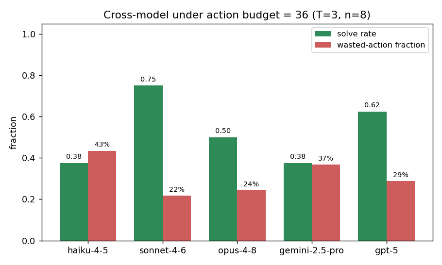

# Resource-Bounded Discovery of Reusable Actions

A minimal benchmark for studying whether LLM agents can **discover, construct, and
efficiently exploit a reusable tool** that no one told them was possible — in an
environment where pretraining priors are suppressed by random relabeling, and where a
hard action budget makes construction a real decision.

The central claim is that three capabilities usually bundled under "tool use" are in
fact **separable**: *recognizing* that a tool is possible, *constructing* it, and
*exploiting* it efficiently under a budget. A five-model pilot is consistent with this
separation — models frequently construct the tool yet remain action-inefficient, so
under a budget they often fail.

This repository contains the environment, the experiment scripts, the data behind the
reported tables (with a byte-exact replay check), and the figures. The one-page abstract
is included as [`abstract.pdf`](abstract.pdf).

## The environment

Each environment `E_n` has `n` locked doors; the task is to open all `n` within an action
budget `B`. The action set is `examine(x)`, `combine(x, y)`, `use(key, door)`, and the
agent sees only a textual observation of the latent state. Two routes solve the family:

- **Grind.** `examine(door)` returns the key to a *uniformly random* door, with
  replacement, so keys repeat — a coupon-collector process with expected cost
  `n·H_n + n` (≈ 30 actions at `n = 8`).
- **Construction.** `examine` also emits an incidental *part*. One hidden pair of
  part-types (out of `T = 3` types, so `C(T,2) = 3` candidate pairs, exactly one correct)
  `combine`s into a *machine* that maps any door to its key deterministically — an optimal
  reuse cost of ≈ `2n + 1` (17 at `n = 8`). Construction lowers expected total cost once
  `n ≥ n* = 3`.

**Relabeling.** Each episode, the tool-relevant tokens (part-types, recipe, machine) are
relabeled by a draw from a random token pool, while door and key indices stay transparent
so the grind route is always legible. Under a relabeling-invariance assumption, this
suppresses task-specific retrieval priors: which pair is the recipe carries no pretraining
signal, so it must be found by interaction rather than recall. The agent is never told that
keys, parts, or a machine exist.

**Budget.** A hard action budget `B = 36 ≈ 1.2 × E[grind]` (well above the ≈ 18–21 a
competent builder needs). The budget is load-bearing: as `B` grows relative to the recipe
search, an agent can stumble onto the recipe by chance, so build-rate alone is
horizon-fragile. The tight budget is what makes discovery strategy and efficient reuse
observable, which is why we treat **budgeted solve rate**, not build-rate, as the primary
quantity.

## Metrics

- **Solve rate** — success (all `n` doors opened) within `B`.
- **Wasted-action fraction** — fraction of actions yielding no state progress (null
  `combine`s, re-opening an open door, machining a door whose key is already held).
- **Build rate** — fraction of episodes in which the machine is constructed.
- **Conditional deployment rate** — conditional on building the machine, whether the model
  then uses it rather than ignoring it (a deployment measure, distinct from efficiency).

## Results (pilot)

Five models, `K = 8` paired episodes each (identical per-episode relabelings across models),
`T = 3`, `n = 8`, `B = 36`. Reasoning models run at "low" effort for comparability. All 40
traces are replay-verified byte-for-byte against the deterministic environment.

| model | solve rate | wasted-action frac. | build rate |
|---|---|---|---|
| Haiku 4.5 | 0.38 | 43% | 0.75 |
| Sonnet 4.6 | 0.75 | 22% | 0.75 |
| Opus 4.8 | 0.50 | 24% | 0.38 |
| Gemini 2.5 Pro | 0.38 | 37% | 0.88 |
| GPT-5 | 0.62 | 29% | 0.75 |



The *conditional deployment rate* is 1.0 for every model — a built tool is never ignored —
yet wasted-action fractions stay high and solve rates low. The failure is not in *valuing*
the tool; it is upstream (the construction search) and downstream (efficient exploitation).
In this pilot, model scale does not monotonically predict budgeted success.

## Reproduce

Requires Python 3.10+ and API keys for the providers you intend to run (see
[`.env.example`](.env.example)).

```bash
python -m venv .venv && source .venv/bin/activate
pip install -r requirements.txt
cp .env.example .env          # then fill in your API keys

# 1. Anthropic budget sweep (Haiku / Sonnet / Opus, 8 reps each)
PYTHONPATH=. python -m scripts.run_budget_sweep

# 2. Reasoning-model extension on the SAME per-rep worlds (GPT-5, Gemini 2.5 Pro)
PYTHONPATH=. python -m scripts.run_budget_sweep_newmodels

# 3. Merge and analyze (groups by model; redraws the figures)
cat runs/budget_sweep_T3_n8_b36_*/episodes.jsonl \
    runs/budget_sweep_newmodels_T3_n8_b36_*/episodes.jsonl \
  > runs/budget_sweep_combined_T3_n8_b36/episodes.jsonl
PYTHONPATH=. python -m scripts.analyze_budget \
    runs/budget_sweep_combined_T3_n8_b36/episodes.jsonl

# 4. Independently replay-verify any run (byte-exact guarantee)
PYTHONPATH=. python -m scripts.replay_toolworld \
    runs/budget_sweep_combined_T3_n8_b36/episodes.jsonl

# No-LLM cost-model validation (coupon-collector vs. construction)
PYTHONPATH=. python -m scripts.validate_toolworld_v2
```

Each rep `r` fixes `(relabel_seed = drop_seed = r)`, shared across models, so the same rep
is the same world — which is why the two sweeps in steps 1–2 concatenate into one paired
dataset in step 3.

## Layout

```
lomekwi/        obfuscation (per-episode relabeling) and the multi-provider chat shim
scripts/        the environment (toolworld_v2.py), sweeps, analysis, replay, validation
runs/           the three budget runs behind the tables, each with episodes.jsonl + figures
abstract.pdf    the one-page abstract
```

The pre-registered shipped data:

- `runs/budget_sweep_T3_n8_b36_20260531_185546/` — Anthropic budget sweep
- `runs/budget_sweep_newmodels_T3_n8_b36_20260601_133952/` — GPT-5 / Gemini 2.5 Pro extension
- `runs/budget_sweep_combined_T3_n8_b36/` — combined five-model set (figures above)

## Status

Work in progress; presented as an abstract at the *Learning in an Agentic World* COLT 2026
workshop. The data is a small pilot (`K = 8`, one budget value, one substrate); see the
abstract for limitations and planned sweeps.
