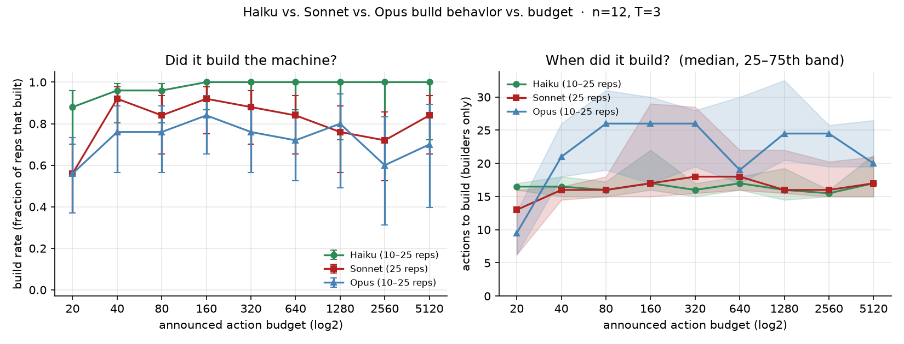
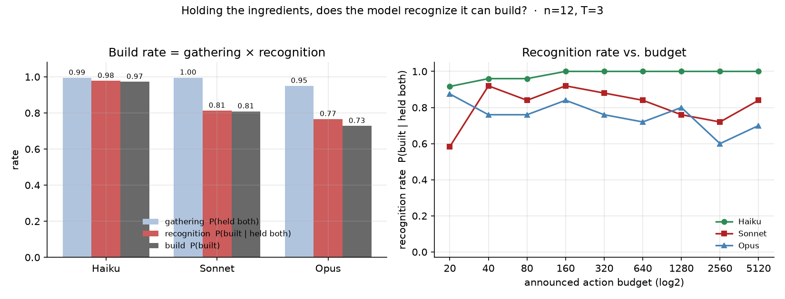
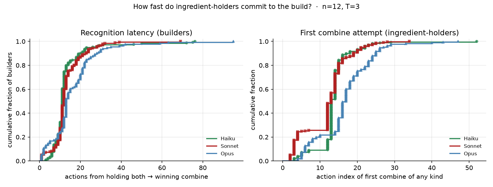

# Tool discovery under bounded resources — project summary

*Prepared 2026-06-15. Scope: everything run to date on the capability × budget question, with results, analysis, and next steps.*

## TL;DR

On an obfuscated tool-discovery task, **the smaller model builds the tool more reliably than the larger one — Haiku 0.97 > Sonnet 0.81 > Opus 0.73 build rate — a clean inverse-scaling result on the capability axis.** Decomposing it shows the gap is **not** in *gathering* the ingredients (flat ~1.0 across models) and **not** confabulation; it lives entirely in **recognition**: holding the exact winning components, Haiku combines them 98% of the time, Opus only 77%. Under our definition (discovery = *recognizing the tool can be made*), this recognition gap **is** the discovery failure.

## Decisions for the meeting

Three things to settle about where the project goes next: **(1) Which mechanism probe first — (H) commitment nudge or (F) oracle-recipe?** Both target the recognition gap on the failed seeds: (H) ("you hold the components — try building") tests whether a one-line nudge closes it (recognition is *closable* vs. a hard deficit); (F) hands Opus the recipe outright to separate recognizing-*that*-it-can-build from recognizing-*which*-pair. My read: (H) first — cheapest, most diagnostic. **(2) When to open the breadth arms — cross-family (GPT-5 / Gemini) and a second environment.** These are what turn a single-benchmark, single-family result into a general claim; the question is whether to start them now in parallel with the mechanism work or hold until (H)/(F) tell us what the mechanism is. **(3) Lock the reporting convention going forward:** adopt recognition rate `P(built | held both)` (or build rate at b≤40) as the headline metric for all future runs, since raw build rate under `stop_on_build` conflates "couldn't build" with "solved-without-building." Proposed sequence: (H) → (F) this week → if recognition gap holds, open cross-family + one new environment in parallel.

---

## 1. Question & setup

**Project goal:** characterize the faculty of LLMs to *discover tools given bounded resources*.

**Environment (`toolworld_v2`).** A sealed vault with `n=12` locked doors; the agent is told nothing about mechanics. Two ways to win:
- **Brute force:** `examine` doors to randomly drop keys, match keys to doors (coupon-collector cost ~ `n·H_n`).
- **Build the tool:** `examine` drops one of `T=3` obfuscated byproduct *types*; combining the *one specific unordered pair of distinct types* (randomized per episode, recorded as `recipe`) fuses into a **machine** that generates keys on demand. Every other combine does nothing — so "which two combine?" is a genuine search (`C(T,2)+T` candidates).

The agent acts under a **strict announced action budget** (swept 20→5120), making build-vs-brute an economic choice. Labels are obfuscated so the agent must *discover* the mechanic, not recall it.

**Capability axis (within one model family):** Claude **Haiku 4.5 → Sonnet 4.6 → Opus 4.8**. The repo's chat shim also routes to GPT-5 / Gemini-2.5 / local Ollama for a future cross-family arm.

---

## 2. Literature context (deep-research pass)

- **Inverse scaling is a documented, named phenomenon** (Inverse Scaling Prize / McKenzie et al. 2023, [arXiv:2306.09479](https://arxiv.org/pdf/2306.09479); U-shaped reversal / Wei et al. 2022, [arXiv:2211.02011](https://arxiv.org/abs/2211.02011)). So "small beats big on a task" is *not* itself novel.
- Larger / RLHF'd models are documented as more prone to sycophancy and worse calibration (Perez et al. 2022; GPT-4 report).
- Agent-hallucination is a recent, named field (MIRAGE-Bench [2507.21017](https://arxiv.org/pdf/2507.21017), AgentHallu [2601.06818](https://arxiv.org/abs/2601.06818)), but it does **not** tie its failure modes to a capability gradient.
- **Two axes must be kept separate:** the Wei U-shape is over *model scale/compute*; inference *budget* is a resource axis whose non-monotonicity (if any) is a different, hazard-driven mechanism — not a Wei-style U.
- **Novelty assessment:** inverse scaling in an *agentic tool-discovery* regime, family-general, with a named mechanism, is unclaimed territory. The bare direction is known; the regime + mechanism is the contribution.

Full report: [docs/inverse-scaling-agentic-confabulation.md](docs/inverse-scaling-agentic-confabulation.md).

---

## 3. Experiments & results

### 3.1 Build-timing sweep across the capability axis

**Setup:** `n=12, T=3`, budgets `[20,40,80,160,320,640,1280,2560,5120]`, 25 reps/budget (10 at the three largest), `stop_on_build=True`, paired worlds (rep `r` → same seed across models), plus a `no_progress` safeguard that caps floundering episodes. Haiku run added 2026-06-14 ($4.18, 0 errors). Scripts: `scripts/run_{haiku,sonnet,opus}_build_sweep.py`.

**Result — build proportion is monotonically inverse in capability:**

| budget | Haiku | Sonnet | Opus |
|---|---|---|---|
| 20 | 0.88 | 0.56 | 0.56 |
| 40 | 0.96 | 0.92 | 0.76 |
| 80 | 0.96 | 0.84 | 0.76 |
| 160 | 1.00 | 0.92 | 0.84 |
| 320 | 1.00 | 0.88 | 0.76 |
| 640 | 1.00 | 0.84 | 0.72 |
| 1280 | 1.00 | 0.76 | 0.80 |
| 2560 | 1.00 | 0.72 | 0.60 |
| 5120 | 1.00 | 0.84 | 0.70 |
| **overall** | **0.972** (175/180) | **0.809** (182/225) | **0.728** (131/180) |

Haiku climbs to 1.00 by b≥160 and stays; Sonnet and Opus do **not** improve with budget — Opus sags in the mid/large range.

*Build rate (left) and actions-to-build among builders (right) vs. budget. The green Haiku line sits above Sonnet (red) and Opus (blue) across the whole range; builders of all three converge to ~15–20 actions, so the difference is in **whether** they build, not how fast.*

### 3.2 Why does Opus build less? — (A) paired-seed trajectory diff

Because worlds are identical per seed and the winning `recipe` is recorded, we compared the *exact same world* where a smaller model built and Opus didn't. Script: `scripts/analyze_paired_build_losses.py`.

- **49 Opus non-builders, all on winnable worlds.** Head-to-head: **Haiku beat Opus 48–4, Sonnet beat Opus 34–19.**
- Decomposition of each loss (holdings are monotonic, so this is exact):
  - **82% (40/49): Opus held BOTH winning ingredients and never issued the winning combine.**
  - 18% (9/49): never gathered both ingredients.
  - 0%: sequencing slips. **0%: confabulation — the safeguard never fired.** (Confabulation was the *earlier, non-`stop_on_build`* budget sweep's $30 runaway; it does **not** drive this gap.)
- The 82% splits by budget: **b≤40 (17 cases) = genuine `out_of_budget` deficit** (smaller models built in ~15 actions on the identical world); **b≥40 (32 cases) = `solved`** — Opus opened all 12 doors by brute force *without building*, every time while holding the recipe.

### 3.3 (E) Recognition vs. gathering decomposition

Build rate factorizes exactly: **build = gathering × recognition** = `P(held both) × P(built | held both)`. Script: `scripts/analyze_recognition_latency.py`.

| model | gathering `P(held both)` | **recognition `P(built\|held both)`** | build `P(built)` |
|---|---|---|---|
| Haiku | 0.99 | **0.98** | 0.97 |
| Sonnet | 1.00 | **0.81** | 0.81 |
| Opus | 0.95 | **0.77** | 0.73 |

**Gathering is flat; the entire inverse-scaling signal is in recognition.**

*Left: build = gathering × recognition — gathering (blue) is ~1.0 for all; recognition (red) and build (gray) drop with capability. Right: recognition rate vs. budget — Haiku saturates at 1.0; Opus sags to ~0.60 and never improves with budget.*

Recognition *latency* among models that do recognize is only modestly worse for Opus (mean 16 vs 13 actions) — the gap is *whether* it commits, not *how fast*:

*ECDFs: Opus (blue) is shifted right (slower to first combine and to the winning combine) but converges — confirming the deficit is recognition rate, not speed.*

---

## 4. Analysis

- **The inverse-scaling is real and lives in recognition.** Holding the exact winning components, the larger model systematically fails to recognize/commit to building. Under our definition (discovery = recognizing the tool can be made), **this is the discovery failure**, not a strategic footnote.
- **It is not what we first guessed.** We predicted confabulation (the documented Opus "fabricate-the-environment" mode). The paired data refuted that for this sweep — 0 safeguard fires, 0 derails. Confabulation is the spectacular tail in the uncapped budget sweep, but the build-rate gap is recognition.
- **It is not a gathering/capability-floor problem** — gathering is flat across models.
- **Metric caveat (important for the writeup):** build rate under `stop_on_build` conflates "couldn't build" with "solved-without-building" (32/49 Opus losses solved by brute force). The **clean metric is recognition rate `P(built | held both)`**, which the figures lead with; complementary clean cut is build rate at b≤40 (too tight to brute-force).
- **Novelty:** known phenomenon (inverse scaling) in an unclaimed regime (agentic tool discovery) with a precise mechanism (recognition gap, not gathering/confabulation). Strongest framing: *"frontier capability under-recognizes a discoverable tool even while holding its components — inverse scaling in agentic discovery."*

---

## 5. Open questions & next steps

**Decisive next experiment — (H) commitment probe.** Re-run the *failed seeds* with a one-line nudge ("you are holding the components — try building it"). If Opus's recognition rate jumps → the deficit is a closable recognition/commitment gap (capability-induced under-recognition, not inability). If not → deeper. Cheap, targeted, not a sweep.

**Other near-term:**
- **(F) oracle-recipe ablation** — give the recipe explicitly to failed seeds; isolates recognition from execution.
- **Deficit-only metric** — recompute build/recognition rate restricted to b≤40 (removes the solve-without-build confound) vs b≥80.
- **Cross-family generality** — GPT-5 and Gemini-2.5 runners (shim already supports them). Does the capability × recognition crossover reproduce outside the Claude family? This is the biggest novelty lever — rules out "Claude-RLHF artifact."
- **More environments** — vary the obfuscation level / construction-hardness knob; does the recognition gap track ambiguity?
- **U-shaped vs monotonic** — would an even more capable model recover (as 6/11 inverse-scaling tasks did in Wei et al.), or is recognition monotonically worse?

**Framing caveat to carry into the meeting:** results are one benchmark, one model family, n=10–25/cell (±~0.15 at the big budgets). The cross-family + more-environments arms are what turn this from a clean single-benchmark result into a general claim.

---

## 6. Artifacts

| Kind | Path |
|---|---|
| Sweep runners | `scripts/run_{haiku,sonnet,opus}_build_sweep.py` |
| Per-run / comparison plots | `scripts/plot_build_sweep.py`, `scripts/plot_build_sweep_compare.py` |
| (A) paired-loss analysis | `scripts/analyze_paired_build_losses.py` |
| (E) recognition decomposition | `scripts/analyze_recognition_latency.py` |
| Run data | `runs/{haiku,sonnet,opus}_build_sweep_T3_n12_*/episodes.jsonl` |
| Figures | `runs/fig_build_compare_haiku_sonnet_opus.*`, `runs/fig_recognition_decomposition.*`, `runs/fig_recognition_latency.*` |
| Deep-research report | [docs/inverse-scaling-agentic-confabulation.md](docs/inverse-scaling-agentic-confabulation.md) |
| Experiment menu (why Opus builds less) | [docs/why-opus-builds-less-experiments.md](docs/why-opus-builds-less-experiments.md) |
