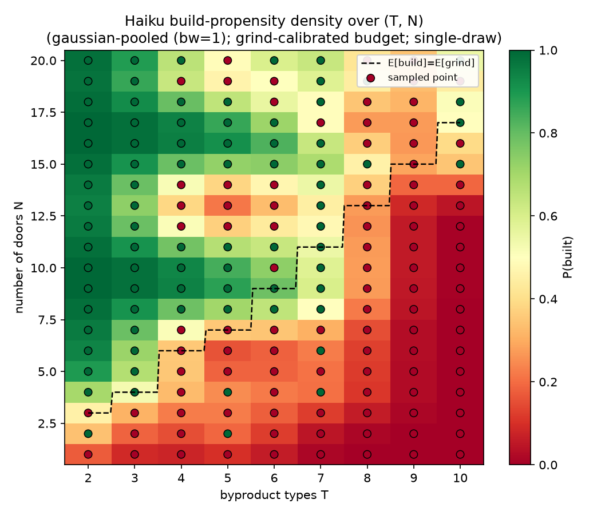
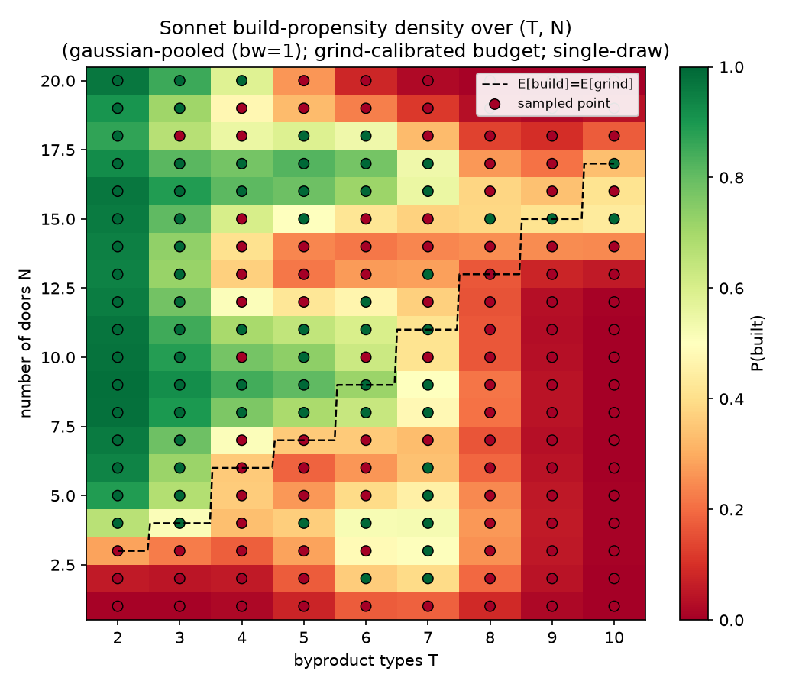
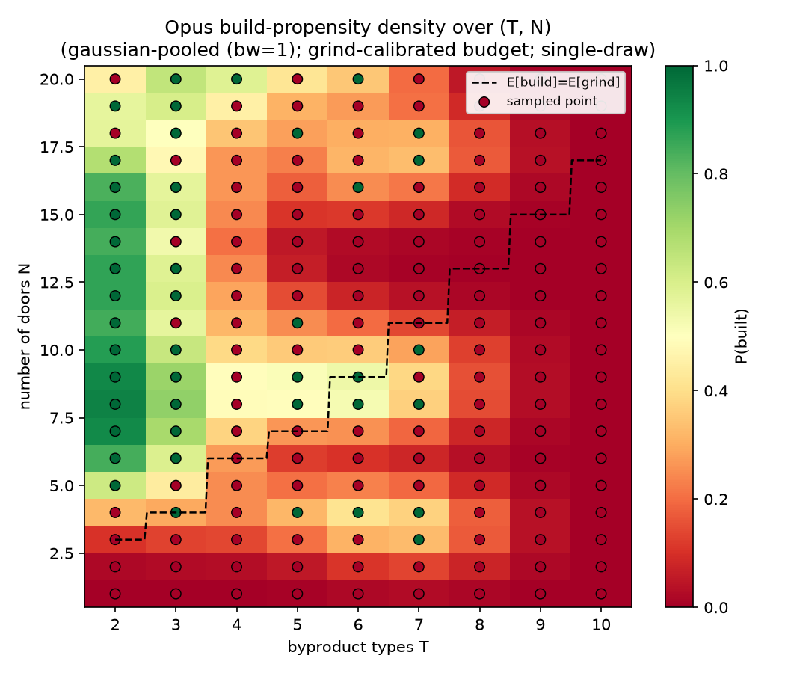
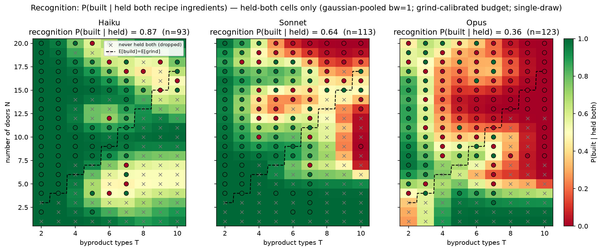
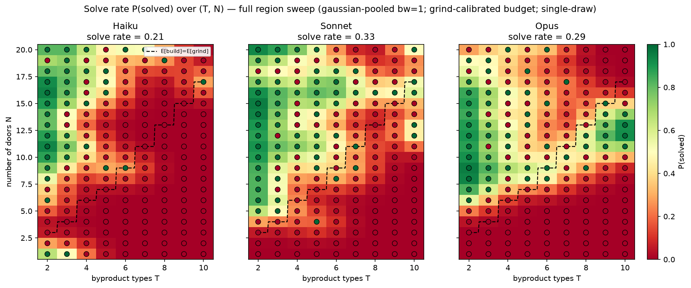
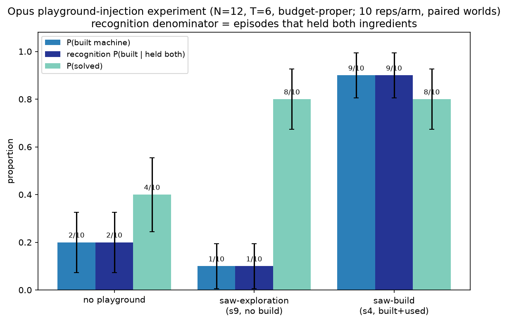
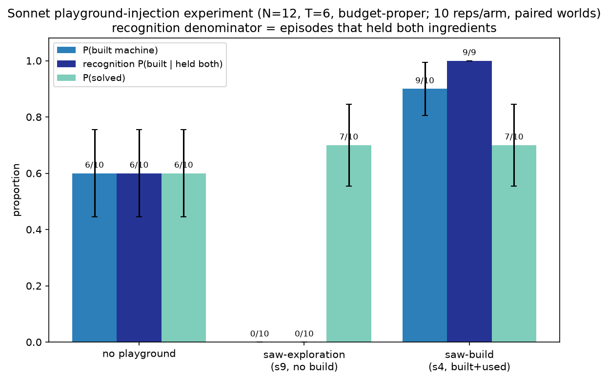
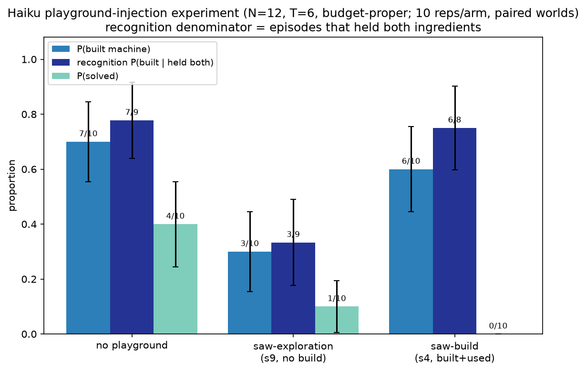

# New experiments, positioning & next-environment design — addendum to the 6-15 summary

*Prepared 2026-06-16. Scope: everything since [6-15-summary.md](6-15-summary.md). Two new experiment families — the **(N, T) region sweep** and the **playground (prior-experience) experiment** — plus a **positioning pass** (where toolworld sits in the benchmark landscape) and a **concrete design for a second environment** (converting Crafter into an LLM tool-discovery task). The 6-15 results (Haiku 0.97 > Sonnet 0.81 > Opus 0.73 single-config build sweep; recognition gap; commitment probe) are unchanged and not restated.*

## TL;DR of what's new

1. **The inverse-scaling generalizes off the single config.** A region sweep over the `(N, T)` design surface (N≤20, T∈[2,10], grind-calibrated budget, run-to-solve) shows `P(built | solved)` is **monotonically inverse** across the whole plane: **Haiku 0.95 > Sonnet 0.80 > Opus 0.60**. The recognition metric `P(built | held both)` is even sharper here — **Haiku 0.87 > Sonnet 0.64 > Opus 0.36** — i.e. the gap *widens* over harder geometries. So it isn't an artifact of `n=12, T=3`.
2. **A "watch someone build it once" demo closes the gap, proportional to each model's deficit.** Injecting a Haiku-generated practice session in which the device was *built and used* (different labels/recipe — only the *mechanic* transfers) lifts build rate by **Opus +0.70 (0.20→0.90), Sonnet +0.30 (0.60→0.90), Haiku ≈0 (0.70→0.60, at ceiling)** at N=12, T=6 — Opus and Sonnet converge to ~0.90, erasing the capability gap. Watching *exploration* instead *hurts* building for all three. Strongest evidence yet for **under-recognition, not inability**, across the whole capability axis; converges with the commitment probe.
3. **Solving and building dissociate — and the hard `(N,T)` corner shows why.** Over the same plane the *solve*-rate ordering **inverts**: **Sonnet 0.33 / Opus 0.29 > Haiku 0.21** — the larger models grind more effectively, so they solve *more* while building *less*. In the hard high-`(N,T)` corner (where grinding is hopeless within budget, so building is the *only* viable route) the split is driven by **combine-propensity** — fraction of actions spent on `combine`: **Haiku 0.45 ≫ Sonnet 0.15 ≫ Opus 0.06**. Haiku flails into the recipe; the capable models "rationally" commit to systematic key-search and miss the tool. Recognition as a *spontaneous behavioral trait*, mirroring the *induced* effects in (2).
4. **Tool *discovery* isn't an existing benchmark category** — the field measures tool use / selection / creation, not discovering an un-enumerated, obfuscated affordance under a budget.
5. **Closest prior art is RL**, not LLM-agent, benchmarks (Crafter/Craftax/MineDojo/NetHack, hide-and-seek, PHYRE). Toolworld = "Crafter's discover-to-craft loop, obfuscated and run as an in-context capability/budget probe."
6. **Design proposed below:** an obfuscated, budget-bounded, text-interfaced **Crafter** as the second environment.

---

## 1. New experiments since 6-15

### 1.1 Region sweep over (N, T) — does the inverse-scaling hold across the design surface?

The 6-15 build sweep fixed `n=12, T=3` and swept budget. This sweep instead **varies the world geometry**: `N` doors (the *build-margin* lever — more doors makes building more worthwhile) × `T` byproduct types (the *discoverability* lever — more types means `C(T,2)+T` candidate combines, so the recipe is harder to find). Each cell uses the **grind-calibrated budget** `cfg.budget_for(n)` (T-independent), and episodes **run to solve** (`stop_on_build=False`), ending on `solved` or `out_of_budget`. Points were sampled across `T∈[2,10] × N∈[1,20]` (Haiku 100 pts, Sonnet/Opus 200 pts, 1 paired seed each). Scripts: `scripts/run_haiku_region_sweep.py` (+ sonnet/opus variants), `scripts/analyze_nt_sweep.py`.

**Metric: `P(built | solved)`** — among episodes that *solved the vault*, what fraction did so by *building the machine* (vs. brute-forcing). This is a clean **disposition** signal: every counted episode succeeded, so it can't be confounded with feasibility or with the `stop_on_build` solve-without-build artifact flagged in 6-15.

| model | solved eps | built ∧ solved | **P(built \| solved)** |
|---|---|---|---|
| Haiku | 37 | 35 | **0.946** |
| Sonnet | 59 | 47 | **0.797** |
| Opus | 53 | 32 | **0.604** |

**The inverse-scaling reproduces as a monotonic disposition across the whole `(N,T)` plane** — not just at one config, and now on the conflation-free metric. The larger model, when it solves, increasingly chooses to *grind* rather than *build the discoverable tool*.

**Built-density across the design surface (Gaussian-pooled).** Pooling the per-cell built outcomes (normalized convolution, σ=1) over the `(N,T)` rectangle gives a legible surface despite 1 rep/cell. The three panels show the same ordering visually — Haiku's build region is broad and dense, Opus's is sparse and confined to the easiest (low-T, high-N) corner:

*Gaussian-pooled built density over `(N,T)` — Haiku (top), Sonnet (middle), Opus (bottom). Opus builds only in the easy corner; difference maps (`figs/_diffs/fig_opus_minus_{haiku,sonnet}_density_Nle20.png`) show almost no cells where Opus builds more. The analytic build-vs-grind boundary (where `E[build] < E[grind]`) is `figs/_analytic/fig_build_vs_grind_region.png`.*

**Recognition holds up on this sweep too — and the gap widens.** Conditioning on the precondition (held both recipe ingredients) and Gaussian-pooling the held-both cells gives the recognition surface `P(built | held both)`:

| model | held-both eps | **`P(built \| held both)`** |
|---|---|---|
| Haiku | 93 | **0.87** |
| Sonnet | 113 | **0.64** |
| Opus | 123 | **0.36** |

These are *sharper* than the single-config (E) numbers (0.98 / 0.81 / 0.77) because the region sweep spans hard geometries (high T = more candidate combines, low N = thin build margin) where recognition is much harder — and **the larger model degrades far more there** (Opus 0.36 vs. 0.77 at the easy `n=12,T=3` point). Script: `scripts/plot_recognition_panels.py`.

*Three-panel `P(built | held both)` over `(N,T)`, Gaussian-pooled (held-both cells only; cells never holding both are dropped). Headline recognition in each title: Haiku 0.87, Sonnet 0.64, Opus 0.36.*

**Caveats:** the solved/held-both subsets are modest (37–123 eps/model) and reps=1, so per-cell values are noisy — read the *aggregate ordering* and the pooled surfaces, not individual cells. Methods note: the `--max-cost` kill switch is **soft** — it stops launching new episodes but in-flight ones drain past the cap, and a resume resets accounting.

### 1.2 Solve rate across the design surface — the capability ordering *flips*

The build/recognition maps say the *smaller* model discovers the tool more. The **solve** map says the opposite about the *task*: pooling `P(solved)` over all 180 cells of each model's sweep (Gaussian σ=1, every cell contributes — solving is defined for all episodes, nothing dropped) gives

| model | solve rate | solved cells |
|---|---|---|
| Haiku | **0.21** | 37/180 |
| Sonnet | **0.33** | 59/180 |
| Opus | **0.29** | 53/180 |

**The ordering inverts relative to building** (Sonnet/Opus solve *more* than Haiku). This is the project's central tension made visual: the stronger models are better at *succeeding at the task* (they grind larger worlds effectively) but worse at *discovering the reusable tool*. The panels show Sonnet/Opus extending their solvable (green) region further up-and-right into larger `(N,T)`, while Haiku's green stays confined to the low-`N` band; for all three, most solved cells sit *above* the analytic `E[build]=E[grind]` boundary — i.e. **most solves are grind-based, not build-based**. Script: `scripts/plot_solve_panels.py`.

*Three-panel `P(solved)` over `(N,T)`, Gaussian-pooled, full region sweep. Solve rate: Haiku 0.21 < Opus 0.29 < Sonnet 0.33 — the inverse of the build/recognition ordering.*

### 1.3 Why the hard corner differs — combine-propensity, not opportunity

Drilling into where the build maps diverge most — the high-`(N,T)` corner (N 17–20, T 8–10) — Haiku builds in **4** cells, Sonnet **1**, Opus **0**. (Methods note: at the *exact* cell (20,9) **none** of the three builds; the apparent "Haiku builds here" on the pooled map is Gaussian bleed from neighbors. The corner *aggregate*, not that cell, is the real effect.)

The driver is **combine-propensity, and it is inversely scaled** — over the corner (N≥15, T≥7):

| model | mean combine-fraction | held both | built |
|---|---|---|---|
| Haiku | **0.45** | 16/24 | **11/24** |
| Sonnet | 0.15 | 23/24 | 6/24 |
| Opus | **0.06** | 24/24 | **2/24** |

Note the **inversion in opportunity vs. action**: Opus *holds both recipe ingredients more often* (24/24 vs Haiku 16/24) yet builds least, because it almost never combines. The clean differentiator cell **N=20, T=10** (all three held both `g,q`): Haiku ran **61 combines**, tried the recipe pair, and built; Sonnet (75 examines / 7 combines) and Opus (74 examines / 8 combines) **never attempted the recipe combine** and didn't build.

The transcripts show *why*: the stronger models frame the large world as a **systematic key-search** — Sonnet t1 *"I need to open 20 doors with at most 110 actions… examine to find keys"*; Opus *"I need to find a tool… examine a door to understand what's needed"* — and grind. Haiku instead lands on a **crafting** framing (*"the q alone doesn't work, I need to combine items"*) and combines near-indiscriminately. At high `N` with a rare-letter recipe (`g`), grinding 20 doors is hopeless within budget, so **building is the only viable path** — and Haiku's flailing is *accidentally the winning policy*, while the capable models' rational commitment to search misses the tool. This is the same recognition mechanism as the playground/commitment interventions, now visible as a **spontaneous behavioral trait** rather than an induced one: Haiku's high baseline combine-rate *is* high recognition.

**Caveats:** single rep/cell (read the corner aggregate, not individual cells). The trait carries a real tradeoff — Haiku's combine-happiness costs it `examine`s, so it collects both ingredients *less* often (16/24 vs 24/24); e.g. at (20,9) Haiku combined 43× but never held both `g` and `q`, so didn't build there.

### 1.4 Playground experiment — does prior experience of *building* recover the larger models?

*(Distinct from the region sweep above (§1.1–1.3): a targeted intervention on a single cell, not a map over the `(N,T)` surface.)*

A direct test of the under-recognition hypothesis. Before a budgeted game, inject **"prior experience"**: the `action → observation` transcript of a free-tinkering practice session on a **differently-relabeled** device (different recipe and labels, so only the *mechanic* transfers — never the game's recipe). The practice transcripts were generated by **Haiku** (a separate `T3_n8`, relabeled pool) and injected as `action → observation` text only — **model-agnostic** (no reasoning), so it carries the mechanic, not Haiku's thinking, and one pool serves every game model. Paired design: the same game worlds across all arms; only the injected context varies. Cell: **N=12, T=6** (hard discoverability — 21 candidate combines), grind-calibrated budget 59, 10 reps/arm, run-to-solve, **on all three game models (Haiku / Sonnet / Opus)**. Scripts: `scripts/gen_playgrounds.py`, `scripts/run_playground_experiment.py`, `scripts/plot_playground_experiment.py`.

Three arms:
- **none** — no prior experience (baseline).
- **explore** — a practice session that *explored* the device but did **not** build.
- **build** — a practice session that *built the machine and used it*.

**Build rate** (recognition `P(built | held both)` in parentheses), per game model × arm:

| game model | none | explore | build | Δ build−none |
|---|---|---|---|---|
| Opus | 0.20 (0.20) | 0.10 (0.10) | **0.90 (0.90)** | **+0.70** |
| Sonnet | 0.60 (0.60) | 0.00 (0.00) | **0.90 (1.00)** | **+0.30** |
| Haiku | 0.70 (0.78) | 0.30 (0.33) | 0.60 (0.75) | −0.10 |

- **The build-demo recovery scales with the deficit — it's a capability-axis effect.** The larger the model's baseline shortfall, the more a single "watch it built once" demo recovers: Opus +0.70 (0.20→0.90), Sonnet +0.30 (0.60→0.90), Haiku ≈0 (0.70→0.60, already near its ceiling with no headroom). **Both Opus and Sonnet converge to ~0.90 build with the demo** — the demonstration effectively *erases the capability gap*. And no recipe leaked: the practice device had different labels and a different recipe, so only the *recognition that building is worthwhile* transferred.
- **Watching exploration *hurts* building for every model** (Opus 0.10, Sonnet 0.00, Haiku 0.30 — all below their own baseline). Content-free familiarity with the device suppresses building (it appears to prime grinding), so the recovery is specific to the **build demonstration**, not to "having seen the device before."
- **Converges with the commitment probe (6-15 §3.4):** a *content-specific* intervention (a build demo / a "try combine" nudge) closes the gap; a content-free one (exploration / neutral nudge) does not — now shown across all three models. Two independent manipulations point to the same mechanism: the larger models *can* build reliably; they under-recognize that they should.

*Build / recognition / solve rate by arm (binomial SE bars), Opus → Sonnet → Haiku. The build-demo arm lifts Opus and Sonnet to ~0.90 build; Haiku (already at its ceiling) is flat. The explore arm sits below baseline for all three.*

**Caveats:** still one cell per model (N=12, T=6), n=10/arm (±~0.15); T=6 makes baselines low, widening headroom — worth replicating at T=3. Recognition denominators are the held-both subsets (8–10/arm). Haiku at T=6 has a lower baseline build rate (0.70) than its T=3 ~0.97, so its "ceiling" here is a hard-cell ceiling, not its global one.

---

## 2. Is "tool discovery" already a benchmark? — landscape check

Existing benchmarks cluster into four buckets; none squarely covers our setting (discover an un-enumerated, obfuscated affordance under a bounded budget):

1. **Tool *use* / function-calling** — given a defined tool set, call it correctly (ToolBench, Berkeley Function-Calling Leaderboard, API-Bank, τ-bench, ToolEmu). Tools enumerated → not discovery.
2. **Tool *selection* / need-awareness** — whether/which tool from a *known* set (MetaTool). Not discovery.
3. **Tool *creation*** — write or define a tool for a *stated* problem (CREATOR, CRAFT [arXiv:2309.17428], LATM). Closest LLM bucket, but the agent is *told* the task and *that* a tool should be made — it doesn't discover the affordance from interaction.
4. **Open-world RL discovery** — see §3. The genuine analogues, but RL-framed and (crucially) **not obfuscated**.

**Verdict (medium confidence):** tool discovery in our sense — recognizing from interaction that an un-enumerated, semantically-obfuscated affordance exists, under a bounded action budget, measured against model capability — is unclaimed. Honest caveat: this rests on our prior literature pass + domain knowledge, not a completed verified survey. Still worth a targeted check before any "novel niche" claim: whether a 2025–26 "open-ended skill discovery" / "agentic exploration" benchmark obfuscates mechanics *and* ties to scale.

---

## 3. The RL lineage (closest prior art)

### Open-world crafting/survival — tightest match to "build a tool to progress"

- **Crafter** (Hafner 2021) — 2D Minecraft-like with a 22-achievement tech tree (wood → table → wood pickaxe → stone → stone pickaxe → …). Tool crafting *is* the progression. [arXiv:2109.06780](https://arxiv.org/pdf/2109.06780)
- **Craftax / Craftax-Classic** (Matthews 2024) — JAX rewrite of Crafter (~250× faster) plus a NetHack-inspired extension; explicitly an open-ended skill-discovery benchmark. [arXiv:2402.16801](https://arxiv.org/html/2402.16801v1)
- **MineDojo** (Fan 2022) — thousands of Minecraft tasks, many requiring tool fabrication, with a CLIP-based learned reward.
- **NetHack Learning Environment** (Küttler 2020) — extreme exploration with deep, discoverable item/tool affordances.
- **SmartPlay** ([arXiv:2310.01557](https://arxiv.org/pdf/2310.01557)) and the contrastive-achievement Crafter work ([arXiv:2307.03486](https://arxiv.org/pdf/2307.03486)) — already benchmark *LLM agents* on these discovery tech trees; the bridge to our framing.

### Emergent tool *discovery* via multi-agent autocurricula

- **OpenAI hide-and-seek** (Baker 2019) — the canonical "agents discover tool use no one told them about": fort-building → ramp use → ramp-locking → box-surfing, including strategies *the researchers didn't know the environment supported*. No tool-use reward. [arXiv:1909.07528](https://arxiv.org/abs/1909.07528)

### Physical tool selection/discovery

- **PHYRE** (Bakhtin 2019) — place a body (a tool) so a goal state emerges after physics simulation. [arXiv:1908.05656](https://arxiv.org/pdf/1908.05656)
- **Virtual Tools game** (Allen 2020) — choose one of several tools to place; heavy exploration emphasis. [arXiv:2312.10728](https://arxiv.org/html/2312.10728v1)
- **KinDER** (2026) — 25 procedurally-generated robot-reasoning envs, one challenge explicitly **tool use**. [arXiv:2604.25788](https://arxiv.org/abs/2604.25788)

### Why none of these is what we're doing

- **Memorization confound.** Crafter/MineDojo/NetHack recipes are recallable from pretraining and wikis, so for an LLM, "discovery" is confounded with recall. Toolworld randomizes semantics per episode (`relabel_seed`), so the affordance can *only* be discovered by interaction.
- **Wrong axis.** These measure whether a *trained policy* discovers tools over millions of steps. We measure whether a *more capable model* discovers better in-context under a bounded budget — where our inverse-scaling result lives.

---

## 4. Converting Crafter into an LLM tool-discovery task

Crafter is the most natural second environment: its tech tree gives **many** discover-and-craft events per episode (vs. toolworld's single machine), and it's an established benchmark. Five moves, the first two project-defining.

### 4.1 The two essential moves

1. **Obfuscate names *and* recipes per episode (the memorization kill).** Relabel every entity/material/tool token (`wood`, `stone`, `table`, `pickaxe`, `furnace`, `iron`…) with opaque seeded tokens, as toolworld does, then **randomize the recipe graph** (which inputs combine into which tool, which tool gates which resource) subject to keeping the tech tree solvable. Without this a frontier LLM just replays Minecraft priors and the capability axis collapses.
2. **Impose a strict announced action budget.** Give a reward target (e.g. "collect K of the deepest resource") and a hard budget so crafting-the-tool-chain vs. brute-collecting is an *economic* choice — the build-vs-grind tension our region sweep maps with `budget_for(n)`.

### 4.2 The three engineering moves

3. **Text/symbolic interface.** Render observations as structured text (JSON/ASCII of nearby tiles + inventory + unlocked-achievement flags); discrete text actions (`move`, `interact`, `place X`, `make X`). SmartPlay / Crafter-as-text already do this — adopt it and layer obfuscation on top. Add **macro-actions** (`navigate_to`, `gather(material, n)`) so the LLM spends budget on *decisions*, not pathfinding, and context stays bounded.
4. **Port the recognition metric directly.** For each tool/achievement `X`, use ground-truth inventory to mark the first turn the agent **holds the prerequisites for `X`**, then measure `P(crafted X | held prerequisites)` — toolworld's `P(built | held both)`, now a *per-achievement curve* up the tech tree. Hypothesis: the recognition gap widens deeper in the tree.
5. **Run the capability axis + the two interventions unchanged.** Same Haiku/Sonnet/Opus on paired seeds. Both 6-15/6-16 interventions transfer verbatim: the **commitment nudge** (hold prerequisites for the next tool, hasn't crafted → fire the pointer) and the **playground/build-demo injection** (prior practice on a relabeled tech-tree branch). Tests whether under-recognition-not-inability generalizes off toolworld.

### 4.3 Risks / open design questions

- **Long-horizon context blowup.** Crafter episodes are far longer than toolworld's. Macro-actions + a compact rolling observation (not full history); cap episode length and report truncation (no-silent-caps).
- **Solvability under randomized recipes.** The shuffle must preserve a feasible topological ordering, ideally with a known optimal action count (the tech-tree analogue of coupon-collector cost, for the build-vs-grind economics).
- **Partial observability.** "Held the prerequisites" is clean (inventory is ground truth), but "had the opportunity to discover" is fuzzier than toolworld's enumerable combine space. Consider starting fully-observed (Craftax-Classic small map) to keep the recognition metric crisp.
- **Craftax vs. Crafter.** Craftax (JAX) buys nothing on LLM rollout speed (the LLM call dominates), but its deeper tech tree gives more discovery events and a longer recognition curve. Lean Craftax-Classic first; full Craftax is the stretch target.

---

## 5. Next steps

- **(F) oracle-recipe** on toolworld — cheap close-out before breadth (splits the residual recognition gap into recognizing-*which-pair* vs. pure commitment). Carried over from 6-15 §5.
- **Extend the playground experiment to T=3** — all three models now run at T=6 (§1.2); the open replication is the easier T=3 cell (lower headroom, closer to the build-sweep config) plus more reps/arm to tighten the ±0.15 bars.
- **Cross-family arm** (GPT-5 / Gemini) — biggest novelty lever; rules out "Claude-RLHF artifact." Carried over from 6-15 §5.
- **Crafter-as-LLM prototype** (§4) — the second-environment arm. Smallest viable slice: Craftax-Classic, fully observed, obfuscated names + shuffled recipes, ~3-deep tech tree, recognition metric per achievement, Haiku-vs-Opus on paired seeds. If the recognition gap reproduces here, the single-benchmark caveat from 6-15 §5 is substantially answered.

---

## 6. Artifacts (new since 6-15)

| Kind | Path |
|---|---|
| Region sweep runners | `scripts/run_{haiku,sonnet,opus}_region_sweep.py`, `scripts/run_nt_sweep.py` |
| Region analysis / plots | `scripts/analyze_nt_sweep.py`, `scripts/plot_haiku_region_heatmap.py`, `scripts/plot_region_diff.py`, `scripts/plot_build_vs_grind_region.py`, `scripts/plot_recognition_panels.py`, `scripts/plot_solve_panels.py` |
| Region run data | `runs/{haiku,sonnet,opus}_region_sweep_*_Nle20_*/episodes.jsonl` (+ `points.json`, `region_*_density*.json`) |
| Region figures | build-rate `figs/{model}_region_p*/fig_*_region_build_rate_Nle20.*`; Gaussian-pooled density `figs/{model}_region_p*/fig_*_density_built_Nle20_gaussian1*.*`; recognition panels `figs/_panels/fig_recognition_panels_Nle20.*`; solve-rate panels `figs/_panels/fig_solve_panels_Nle20.*`; diffs `figs/_diffs/fig_*_minus_*_density_Nle20.*`; analytic boundary `figs/_analytic/fig_build_vs_grind_region.*` |
| Playground experiment | `scripts/gen_playgrounds.py`, `scripts/run_playground_experiment.py`, `scripts/plot_playground_experiment.py` |
| Playground run data / figs | `runs/{opus,sonnet,haiku}_playground_expt_T6_n12_*/` (+ `design.json`), `figs/_playground/fig_playground_experiment_{opus,sonnet,haiku}_n12_T6.*`; demo pool `playgrounds/T3_n8/` |

Prior artifacts (build sweeps, recognition decomposition, commitment probe, deep-research report, experiment menu) are unchanged — see [6-15-summary.md](6-15-summary.md) §6.
