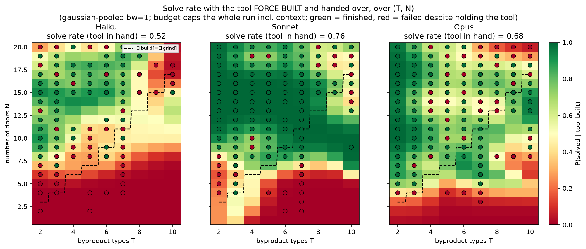
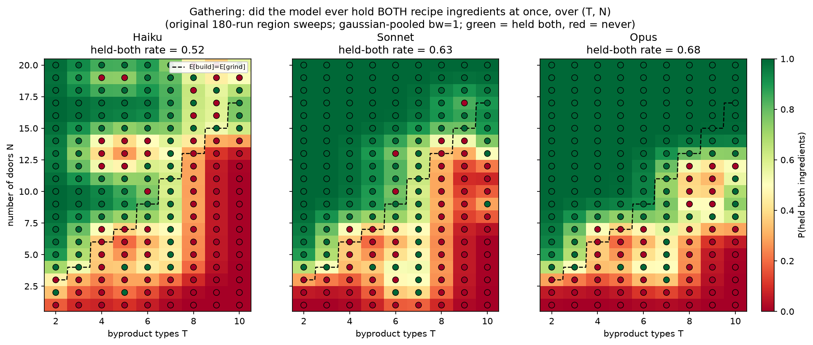

# Tool-efficiency experiments — addendum to the 6-16 summary

*Prepared 2026-06-17. Scope: everything since [6-16-summary.md](6-16-summary.md). One new experiment family — the **tool-efficiency region sweep** — which holds recognition constant by **force-building the tool** and then measures how well each model *exploits* it. **Efficiency is defined as `P(solved | tool built)`** — handed the built tool, does the model open all the doors within budget? Run for all three models (Haiku, Sonnet, Opus) over the same `T∈[2,10] × N≤20` plane as the recognition sweeps, plus new three-model panels and a full **`build = gather × recognize × efficiency`** decomposition of the solve rate. The 6-16 results (region sweep `P(built|solved)` Haiku 0.95 > Sonnet 0.80 > Opus 0.60; recognition gap; playground demo; solve-rate inversion) are unchanged and not restated.*

## TL;DR of what's new

1. **A new axis: tool-EXPLOITATION efficiency.** For every recorded run in which the model *held both ingredients*, we replay it up to that point, **artificially force the winning combine** (so the machine is guaranteed built), then hand control back to the live agent and let it continue. **Efficiency = `P(solved | tool built)`** isolates "given the tool, can you finish?" from "do you discover/build it?".
2. **Efficiency orders *with* capability — the opposite of recognition.** Solve rate with the tool in hand: **Sonnet 0.76 > Opus 0.68 > Haiku 0.52**. So the smaller model discovers the tool more (6-16) but *exploits it worst*; the capable models finish more reliably once it exists.
3. **Opus occasionally spirals after building.** A minority of Opus cells (notably high-T) fail to solve despite holding the tool, because Opus falls into **post-build confabulation spirals** — e.g. repeatedly issuing `combine k q → "you already hold a o"` long after building, never operating the machine. The capability that makes it efficient most of the time fails in a minority of cells.
4. **Full decomposition of the solve rate.** With `C = P(held both)`, `R = P(built | held both)`, `E = P(solved | tool built)`, the build-path solve probability is `Z = C·R·E`: **Sonnet 0.30 > Haiku 0.23 > Opus 0.17**. Sonnet wins by being *balanced* (no weak stage); Haiku is carried by recognition (R=0.87) despite weak gathering/efficiency; **Opus is bottlenecked by its recognition collapse (R=0.36)** even though it gathers (0.68) and exploits (0.68) well.
5. **Where the capable models actually succeed, they grind — not build.** Subtracting the actual solve rate `S` from the build-path estimate, `(C·R·E) − S`, is strongly **negative for Opus in the high-T region** (it solves far beyond what building predicts) — direct visual confirmation that Opus's task success comes from *grinding*, not from discovering the reusable tool.

---

## 1. The tool-efficiency sweep

### 1.1 Design

The recognition sweeps (6-15/6-16) ask *whether* a model discovers and builds the tool. This sweep asks the downstream question: **handed the built tool, does it finish?** We hold recognition constant by forcing the build, so any remaining variation is pure exploitation.

For each non-error run in a completed region square (e.g. `runs/haiku_region_sweep_p100_r1_Nle20_*`):

1. Find the first turn `ab` where the agent held **both** recipe ingredients (the `acquire_both_turn` detector from `analyze_recognition_latency`). Runs that never held both are **omitted**.
2. Replay `actions[0..ab]` through a fresh world — using the agent's **recorded reasoning text** as context — so the live model is handed the whole prior run.
3. Inject **one artificial forced action**: the correct combine of the two recipe types, which builds the machine.
4. Hand control to the **live agent** and continue until **solved** (all doors open) or out of budget.

**Efficiency = `P(solved | tool built)`** — the fraction of these guaranteed-built continuations that go on to open every door. The **budget** = `cfg.budget_for(n)` and caps the **entire** run including the replayed context and the forced combine, so live budget = `budget − (ab + 2)`. The world is rebuilt with `world_from_labels` (reads recorded label strings), making replay byte-exact regardless of the ambient obfuscation scheme — verified by `prefix_obs_verified == True` on **every** run across all three models. Implementation: `scripts/run_haiku_efficiency_sweep.py` (model-agnostic via `--model`/`--source`); `run()` in `scripts/toolworld_v2.py` gained `world_override` + `forced_prefix` (a replay-without-API-calls prefix that then goes live).

### 1.2 Headline results

| model | held-both runs | **efficiency = solved-with-tool** | cost |
|---|---|---|---|
| Haiku | 93 (1 degenerate) | 48/92 → **0.52** | $9.14 |
| Sonnet | 113 | 86/113 → **0.76** | $6.15 |
| Opus | 123 (1 reconstructed) | 84/123 → **0.68** | ~$20 |

*"Degenerate" = no live budget remained after the context (recorded directly, no API call). The one Opus cell (T=7/N=19) was killed mid-spiral and **reconstructed** as a non-solve under the assumption that all post-kill steps stay redundant — see §3.*

**Efficiency runs *with* capability**, the mirror image of the recognition inverse: Sonnet finishes most often once handed the tool, Haiku least. This is the same dissociation seen in 6-16's solve-vs-build inversion, now isolated to the pure exploitation stage.

---

## 2. Three-model panels

### 2.1 Efficiency panel (E)

`scripts/plot_efficiency_solve_panels.py` → `figs/toolworld/_panels/fig_efficiency_panels_Nle20.*`. Each cell is 1 if that forced-build episode **solved** (opened all doors), 0 otherwise — i.e. `P(solved | tool built)`, Gaussian-pooled. Green = finished with the tool in hand, red = failed despite holding it.

*Efficiency Sonnet 0.76 > Opus 0.68 > Haiku 0.52. **Caveat visible in the map:** the entire low-N bottom band is red for all three — a budget-binding artifact, not inability. At small N the grind-calibrated budget is tiny, so after the prefix (context + forced build) consumes it there aren't enough actions left to open all doors. The green upper region (more budget headroom) is where genuine capability differences show. The per-row `live_remaining` / `stopped_reason` fields preserve this distinction.*

### 2.2 Gathering panel (C)

`scripts/plot_held_both_panels.py` → `figs/toolworld/_panels/fig_industry_panels_Nle20.*`, read from the **original 180-run region squares**. Each cell is 1 if the model ever held **both** recipe ingredients at once — the `P(held both)` gathering rate that selects the efficiency runs.

*Gathering Opus 0.68 > Sonnet 0.63 > Haiku 0.52 — tracks *with* capability (stronger models examine/explore more effectively, so they coupon-collect both byproduct types more often). Red low-N band: too few examines to gather both types in small worlds; green fills in as N (examine count) grows.*

---

## 3. The killed Opus cell (T=7, N=19) — reconstruction

During the Opus sweep one continuation (T=7, N=19) entered a post-build spiral — stuck at 11/19 doors, confabulating `combine k q → "you already hold a o"` and bad-key uses, never operating the machine — and was **killed** before it wrote its row. It was ~7 actions from `out_of_budget` anyway. Per the "assume all post-kill steps stay redundant" decision, its row was **reconstructed** and tagged `"reconstructed": true`: it runs to `out_of_budget` and **does not solve** (stuck at 11/19), so it counts as a 0 in the efficiency panel. This keeps the Opus map gap-free (123/123 cells) and is clearly distinguishable in the data from live rows (zeroed `usage`, `reconstruction_note`).

---

## 4. Decomposing the solve rate: `build = gather × recognize × efficiency`

The build-path solve probability factorizes as `Z = C · R · E`:

- `C = P(held both)` — gathering (§2.2, original region square)
- `R = P(built | held both)` — recognition (`fig_recognition_panels`, 6-16)
- `E = P(solved | tool built)` — efficiency (§2.1)

`scripts/plot_solve_decomp_panels.py` pools each factor separately (the shared normalized-Gaussian convolution) and multiplies **after** pooling.

| model | C (gather) | R (recognize) | E (efficiency) | **C·R·E** |
|---|---|---|---|---|
| Sonnet | 0.63 | 0.64 | 0.76 | **0.30** |
| Haiku | 0.52 | 0.87 | 0.52 | **0.23** |
| Opus | 0.68 | 0.36 | 0.68 | **0.17** |

**The product reorders the models versus any single factor.** Sonnet wins overall by being *balanced* — no weak stage. Haiku is carried by its dominant recognition (0.87) despite the weakest gathering and efficiency. **Opus ranks last**: it gathers and exploits well, but its recognition collapse (0.36) bottlenecks the whole chain — exactly the central tension, localized to the recognition stage.

### 4.1 Build-path estimate vs. actual solving: `(C·R·E) − S`

Subtracting the **actual** overall solve rate `S = P(solved)` (`fig_solve_panels`, region square — build- *and* grind-based solves together) from the build-path estimate. `scripts/plot_solve_decomp_minus_panels.py`, diverging scale: **red = build-path over-predicts; blue = the model solves *beyond* the build path (it grinds).**

| model | C·R·E | S = P(solved) | **(C·R·E) − S** |
|---|---|---|---|
| Haiku | 0.23 | 0.21 | **+0.03** |
| Sonnet | 0.30 | 0.33 | **−0.02** |
| Opus | 0.17 | 0.29 | **−0.13** |

- **Haiku** — net slightly positive, with a **red blob just left of the `E[build]=E[grind]` line (mid-T, N≈12–17)**: its strong recognition predicts more build-path solving there than it actually achieves (the efficiency/budget tax eats the rest).
- **Sonnet** — near-zero almost everywhere: the build-path estimate closely matches its actual solving (balanced, little grinding).
- **Opus** — strongly **blue in the high-T, mid/high-N region**: actual solving far exceeds the build-path estimate because recognition collapses there yet Opus still solves — **it is grinding, not building**. The clearest single visual of the project's central tension.

---

## 5. Observations

- **The capability story is stage-dependent.** Gathering and efficiency improve with capability (Opus/Sonnet > Haiku); recognition *inverts* (Haiku > Sonnet > Opus). End-to-end build-path success is therefore non-monotonic in capability and maximized by the *balanced* model (Sonnet).
- **Under-recognition, not inability, again.** The capable models can clearly *use* the tool once it exists (high efficiency) — they simply don't *commit to building it*. Consistent with the 6-16 playground-demo and commitment-probe results.
- **Opus's failure mode is a confabulation spiral, not incompetence.** It exploits cleanly in most cells; the misses concentrate in a minority of (high-T) cells where it loops on impossible re-combines after already building. This matches the broader "Opus confabulates mechanics under ambiguity" pattern.
- **Method caveat to carry forward:** because the budget caps the whole run including context, low-N cells are budget-bound and should be read accordingly (filter on `live_remaining`/`stopped_reason`), not the raw solve flag.

---

## Artifacts

| Artifact | Path |
|---|---|
| Efficiency sweep runner (model-agnostic) | `scripts/run_haiku_efficiency_sweep.py` |
| `run()` with `world_override` + `forced_prefix` | `scripts/toolworld_v2.py` |
| Efficiency (solve-with-tool) panel | `scripts/plot_efficiency_solve_panels.py` → `figs/toolworld/_panels/fig_efficiency_panels_Nle20.*` |
| Gathering panel | `scripts/plot_held_both_panels.py` → `figs/toolworld/_panels/fig_industry_panels_Nle20.*` |
| Decomposition panels | `scripts/plot_solve_decomp_panels.py`, `scripts/plot_solve_decomp_minus_panels.py` → `figs/toolworld/_panels/fig_solve_decomp{,_minus}_panels_Nle20.*` |
| Efficiency run data | `runs/{haiku,sonnet,opus}_efficiency_sweep_Nle20_*/episodes.jsonl` (+ `meta.json`) |
| Source region squares (for C, R, S) | `runs/{haiku,sonnet,opus}_region_sweep_*_Nle20_*/` |

*Note on figure naming: the efficiency panel file is `fig_efficiency_panels_Nle20` (solve-with-tool content; the generating script is still `plot_efficiency_solve_panels.py`), and the gathering panel file is `fig_industry_panels_Nle20` (generated by `plot_held_both_panels.py`) — both renamed by hand after generation.*

Headline three-model numbers: gathering **C** = Opus 0.68 / Sonnet 0.63 / Haiku 0.52; recognition **R** = Haiku 0.87 / Sonnet 0.64 / Opus 0.36; efficiency **E** = Sonnet 0.76 / Opus 0.68 / Haiku 0.52; build-path **C·R·E** = Sonnet 0.30 / Haiku 0.23 / Opus 0.17.

---
---

# Woodworld — a bespoke second environment for tool discovery (6-17, later session)

*Scope: a separate work stream from the efficiency sweep above. We attempted to replicate the toolworld reusable-tool result on a standard benchmark, abandoned **TextCraft**, and built **woodworld** — a minimal "build-or-fail" economic task with a persistent reusable tool — then ran a full capability-axis study (Haiku/Sonnet/Opus), a CoT mechanism analysis, and several hint/verb interventions.*

## TL;DR

1. **TextCraft can't express the phenomenon.** We wired up obfuscated TextCraft (cloned ADaPT, Minecraft 1.16.5 recipes) but its `craft` always *consumes* inputs and there is no use/durability layer — pickaxes are craftable but never *used*, raw materials come free via `get`. So "build a persistent tool once, reuse it N times" has no representation. **TextCraft work was removed.**
2. **Woodworld** (`scripts/woodworld.py`): three verbs — `gather` (+1 wood w.p. `p`), `combine` (2 wood→4 sticks; 1 stick + 1 wood→axe), `use` (axe→+2 wood, **persistent**). Goal: hold **N** wood within a budget **B = round(M·N/p)**. Names obfuscated per episode (letter scheme); recipes/effects **discovered**, not told. The axe is the toolworld-machine analog.
3. **The capability ordering on building is OPPOSITE to toolworld.** Region sweep (N=2–20, p=0.2–1.0, hint on, M=1.0): build rate **Haiku 0.06 < Sonnet 0.50 < Opus 0.63** — *monotonic with* capability, the mirror image of toolworld's inverse-scaling. **Why: the bottleneck here is recipe *discovery*** (a blind 2-distinct-ingredient combine with exact counts), which capability helps — vs. toolworld's combine-2-identical affordance, which is trivially discoverable so *disposition* dominates. **Discoverability of the affordance decides whether you measure discovery (monotonic) or disposition (inverse).**
4. **The build gap is a discovery gap, not a follow-through gap.** Decomposition: *tried combining* Haiku 19% vs Sonnet/Opus ~90%; *got sticks* 16/102/151; but *P(built | got sticks)* is flat-ish **0.69 / 0.84 / 0.71** (Sonnet the best converter). The capability ordering is set almost entirely by whether the model explores combining and discovers the recipe.
5. **CoT analysis of why Haiku won't combine** (read across both region runs): not one mechanism — the backbone is **deferred-intention → budget-exhaustion** ("gather enough first, then craft", never arrives); plus **respawn/cycle misread** of stochastic gather-misses (~25%), **conceptual absence** of crafting (60% under hint-off), and **misreading correct intermediates (sticks) as a *loss*** — the last partly *induced by the net-wood goal* (crafting consumes wood, so the goal counter drops).
6. **Interventions** (all at p=0.5, N=10, M=1.0, n=40): renaming `craft`→`combine` (to match the hint) gives a small, consistent-but-not-significant lift to exploration. A cryptic ToolWorld-style **dynamic stick hint** drives **near-perfect follow-through** P(built|sticks) for both Haiku (5/5) and Sonnet (27/28); the gap stays upstream — **Sonnet tries combining 40/40 and builds 0.68; Haiku tries 0.33, builds 0.12.**

---

## 1. Woodworld design

| element | value |
|---|---|
| actions | `gather` · `combine <a> <b> …` · `use <item>` (only three) |
| gather | +1 wood with prob `p` (default 0.8), else +0; stochastic, seeded |
| recipes (hidden, editable) | `2 wood → 4 sticks`; `1 stick + 1 wood → axe` |
| use | `use axe → +2 wood`, axe NOT consumed (the persistent tool); `use <other> → nothing` |
| goal | hold **N** wood (net inventory) within budget |
| budget | **B = round(M · N / p)** — grind-calibrated; `M` = `BUDGET_MULT` |
| obfuscation | latent {wood, stick, axe} relabeled per episode (`letter` scheme; only the goal token is named) |
| knowledge | discovery — agent told only the verbs, goal, budget, and a subtle hint |

**Economics.** Grinding yields `p`/action → reaching N needs ~N/p actions. Building the axe costs 3 wood + 2 crafts up front, then `use axe` gives +2/action. Analytic build-vs-grind boundary (this recipe): **N = (6 + 4p)/(2 − p)**; building is cheaper above it (`scripts/plot_woodworld_build_region.py`, p on the x-axis). Cost model + N\* in `scripts/validate_woodworld.py`.

**Budget calibration evolved during the session:**
- `B = 1.2·N` (initial literal spec) — but p-independent, which makes some low-N/low-p cells unsolvable by *any* strategy.
- `B = round(1.2·N/p)` — grind-calibrated (toolworld convention): brute is a viable-but-tight escape hatch at every p, so building is *optional* and solve rate stays near-ceiling. P(pure-grind solves) ≈ **0.88** mean over the grid.
- `B = round(1.0·N/p)` (**current**) — no grind surplus (E[grind wood] = N exactly), so pure grinding is a coin-flip (~0.59) and building becomes the path that *reliably* solves. This is the "forced" regime where solve rate itself becomes a build signal.

Files: `scripts/woodworld.py`, `validate_woodworld.py`, `woodworld_config.py`, `run_woodworld_sweep.py`, `replay_woodworld.py` (byte-exact incl. stochastic gather, verified), `analyze_woodworld.py`, `plot_woodworld_build_region.py`, `run_woodworld_region_sweep.py`, `plot_woodworld_region_heatmap.py`.

---

## 2. Region sweeps (N=2–20, p=0.2–1.0, 1 rep/cell, hint on, M=1.0)

171 cells/model, run-to-solve, no_progress window scaled `round(12/p)` so low-p gatherers aren't falsely aborted. Gaussian-pooled **box** heatmaps in the toolworld RdYlGn style (`figs/woodworld/region/{model}/fig_woodworld_region_build_solve_{model}_hint_mult1_Nle20.*`), boundary `N=(6+4p)/(2−p)` overlaid.

| model | build rate | solve rate | cost |
|---|---|---|---|
| Haiku | **0.06** | 0.71 | $4.75 |
| Sonnet | **0.50** | 0.58 | $5.53 |
| Opus | **0.63** | 0.57 | $10.11 |

*(For reference, earlier Haiku runs: hint-off M=1.2 → build 0.01 / solve 0.98; hint-on M=1.2 → 0.05 / 0.94. Tightening M and adding the hint both raise build modestly; the big mover is model capability.)*

- **Build rate scales WITH capability** (opposite to toolworld) and the Sonnet/Opus build-rate maps show real structure — green (build) above the boundary, red below — i.e. they build *where building is rational*. Haiku's map is flat-red.
- **Solve rate inverts** (Haiku 0.71 > Sonnet/Opus ~0.57): at the tight M=1.0 budget the strong builders *over-invest* in the axe (building isn't budget-feasible at small N) and run out, while Haiku grinds into the coin-flip.

### 2.1 Decomposition — discovery, not follow-through

| model | tried combining | got sticks | **P(built \| sticks)** | build rate |
|---|---|---|---|---|
| Haiku | 32/171 (19%) | 16 | 0.69 (11/16) | 0.06 |
| Sonnet | 157/171 (92%) | 102 | **0.84** (86/102) | 0.50 |
| Opus | 154/171 (90%) | 151 | 0.71 (107/151) | 0.63 |

Opus discovers the recipe most reliably (151 sticks, almost never a failed craft); Sonnet is the best stick→axe converter; Haiku rarely leaves the gather-only basin (its 0.69 rests on n=16). The 10× build-rate spread is driven by *getting to sticks*, while conditional follow-through is a much flatter ~0.7–0.85.

---

## 3. Why Haiku almost never combines — CoT taxonomy

Read across both Haiku region runs (171 eps each). % of no-combine episodes, hint-on / hint-off:

| mechanism | ON | OFF |
|---|---|---|
| A. gathering was actually sufficient (high p; correctly no need) | 28% | 14% |
| B. **deferred intention → budget exhaustion** ("gather enough first, then craft") — the backbone, unchanged by hint | 18% | 18% |
| C. respawn / cycle / delay misread of stochastic gather-misses | 25% | 8% |
| D. reads hint as `use`, not combine | 4% | 0% |
| E. **never mentions crafting at all** (conceptual absence) | 25% | **60%** |

And among episodes that *did* combine but failed: a single **wrong-quantity** attempt ("combine all my wood") then revert (16/21), or **misreading sticks as a loss** ("I lost the r / wrong direction", 5/21) — never assembling the two-step wood→sticks→axe chain. The hint shifts *talk* (combine-mentions 40%→75%) far more than *action*. The "sticks-as-loss" reading is partly **induced by the net-wood goal** (crafting drops the visible wood counter), which is a design lever.

---

## 4. Interventions (p=0.5, N=10, M=1.0, n=40 unless noted)

**Verb `craft`→`combine`** (to match the hint's "combined"; `craft` kept as a parser alias). Paired n=40 A/B, same seeds: `combine` ≥ `craft` on every stage — tried 0.50 vs 0.33, got-sticks 0.28 vs 0.15, built 0.23 vs 0.15, stick-crafts 14 vs 7. Consistent direction, **not significant at n=40** (build diff +0.07, SE 0.09). (Earlier n=10 comparisons were misleading — a lucky craft 0.40 draw.)

**Hint redesign**: opening hint trimmed to combine-only (dropped the `use`/"operated again and again" clause); added a cryptic dynamic stick hint — *"The m feels faintly active, and the sensation shifts when held alongside other items"* (fires for any combinable intermediate, hint-on only). 40-rep results:

| metric | Haiku (new hints) | Sonnet (new hints) | Haiku (prior `combine` baseline) |
|---|---|---|---|
| tried combining | 0.33 | **1.00** | 0.50 |
| got sticks | 0.12 | 0.70 | 0.28 |
| built axe | 0.12 | **0.68** | 0.23 |
| P(built \| sticks) | **5/5 = 1.00** | **27/28 = 0.96** | 9/11 = 0.82 |

- The **stick hint works**: near-perfect sticks→axe follow-through for both models — it closes the "sticks-as-loss" / stick-on-stick step.
- But **trimming the opening hint lowered Haiku's exploration** (tried 0.50→0.33), so net Haiku build dipped (0.23→0.12) — opposite effects at the two stages. (User chose to keep the trimmed opening hint.)
- **Sonnet explores 40/40 and builds 0.68** — the capability gap is entirely upstream (whether the model tries combining), since follow-through is near-ceiling for both once sticks exist.

---

## 5. Key takeaway & caveats

- **Discoverability flips the capability ordering.** Toolworld (easy-to-stumble affordance) → inverse-scaling on building (disposition-limited). Woodworld (blind multi-ingredient recipe) → monotonic-with-capability building (discovery-limited). Both are "tool discovery," but they probe different stages — worth stating explicitly when positioning the work.
- **Small-n caution:** the per-cell region sweeps are 1 rep (Gaussian-pooled, toolworld convention); the intervention pilots are n=40 and most stage-level differences are not individually significant. The verb/hint effects are *suggestive*, not established — pinning them down needs ~100+ reps or full new-hint region sweeps.
- **Open threads:** a Sonnet/Opus region sweep with the new hints; an old-vs-new-hint A/B to isolate the hint effect; and testing the goal-metric lever (cumulative vs net wood) suggested by the "sticks-as-loss" mechanism.

## Artifacts

| Artifact | Path |
|---|---|
| Env + cost model + config | `scripts/woodworld.py`, `validate_woodworld.py`, `woodworld_config.py` |
| Region sweep runner / replay / analysis | `scripts/run_woodworld_region_sweep.py`, `replay_woodworld.py`, `analyze_woodworld.py` |
| Build-vs-grind region (analytic, p on x) | `scripts/plot_woodworld_build_region.py` → `figs/woodworld/analytic/fig_woodworld_build_vs_grind_region.*` |
| Pooled build/solve box heatmaps | `scripts/plot_woodworld_region_heatmap.py` → `figs/woodworld/region/<model>/fig_woodworld_region_build_solve_<model>_hint_mult1_Nle20.*` |
| Region run data | `runs/{haiku,sonnet,opus}_woodworld_region_r1_*_N2-20_*/episodes.jsonl` |
| Intervention pilots (verb A/B, new hints) | `runs/woodworld_{combine40,craft40,newhint40,newhint40_sonnet}_*/episodes.jsonl` |
