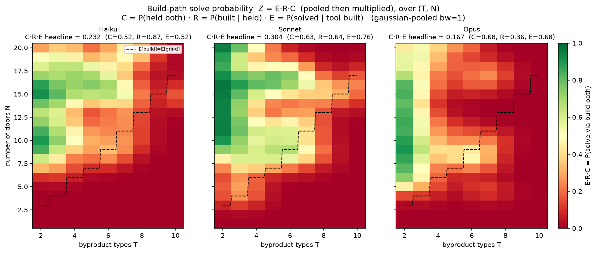
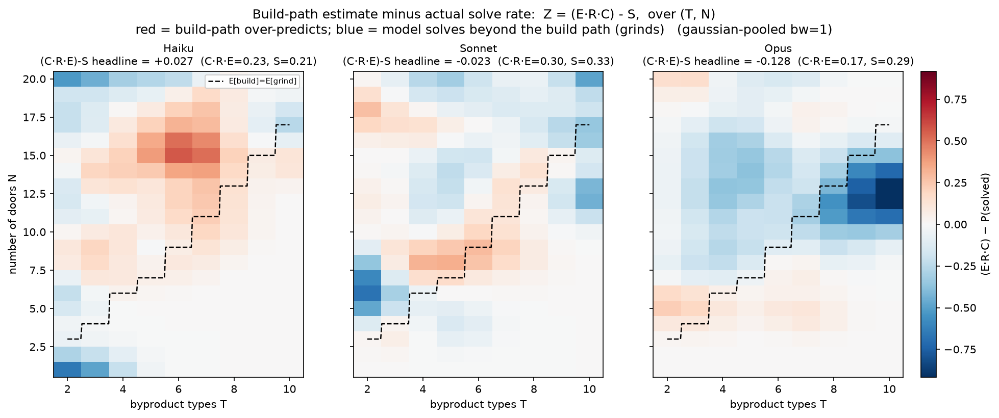

# Tool-efficiency experiments — addendum to the 6-16 summary

*Prepared 2026-06-17. Scope: everything since [6-16-summary.md](6-16-summary.md). One new experiment family — the **tool-efficiency region sweep** — which holds recognition constant by **force-building the tool** and then measures how well each model *exploits* it. **Efficiency is defined as `P(solved | tool built)`** — handed the built tool, does the model open all the doors within budget? Run for all three models (Haiku, Sonnet, Opus) over the same `T∈[2,10] × N≤20` plane as the recognition sweeps, plus new three-model panels and a full **`build = gather × recognize × efficiency`** decomposition of the solve rate. The 6-16 results (region sweep `P(built|solved)` Haiku 0.95 > Sonnet 0.80 > Opus 0.60; recognition gap; playground demo; solve-rate inversion) are unchanged and not restated.*

## TL;DR of what's new

1. **A new axis: tool-EXPLOITATION efficiency.** For every recorded run in which the model *held both ingredients*, we replay it up to that point, **artificially force the winning combine** (so the machine is guaranteed built), then hand control back to the live agent and let it continue. **Efficiency = `P(solved | tool built)`** isolates "given the tool, can you finish?" from "do you discover/build it?".
2. **Efficiency orders *with* capability — the opposite of recognition.** Solve rate with the tool in hand: **Sonnet 0.76 > Opus 0.68 > Haiku 0.52**. So the smaller model discovers the tool more (6-16) but *exploits it worst*; the capable models finish more reliably once it exists.
3. **Opus occasionally spirals after building.** A minority of Opus cells (notably high-T) fail to solve despite holding the tool, because Opus falls into **post-build confabulation spirals** — e.g. repeatedly issuing `combine k q → "you already hold a o"` long after building, never operating the machine. The capability that makes it efficient most of the time fails in a minority of cells.
4. **Full decomposition of the solve rate.** With `C = P(held both)`, `R = P(built | held both)`, `E = P(solved | tool built)`, the build-path solve probability is `Z = C·R·E`: **Sonnet 0.30 > Haiku 0.23 > Opus 0.17**. Sonnet wins by being *balanced* (no weak stage); Haiku is carried by recognition (R=0.87) despite weak gathering/efficiency; **Opus is bottlenecked by its recognition collapse (R=0.36)** even though it gathers (0.68) and exploits (0.68) well.
5. **Where the capable models actually succeed, they grind — not build.** Subtracting the actual solve rate `S` from the build-path estimate, `(C·R·E) − S`, is strongly **negative for Opus in the high-T region** (it solves far beyond what building predicts) — direct visual confirmation that Opus's task success comes from *grinding*, not from discovering the reusable tool.

---

## 1. The tool-efficiency sweep

### 1.1 Design

The recognition sweeps (6-15/6-16) ask *whether* a model discovers and builds the tool. This sweep asks the downstream question: **handed the built tool, does it finish?** We hold recognition constant by forcing the build, so any remaining variation is pure exploitation.

For each non-error run in a completed region square (e.g. `runs/haiku_region_sweep_p100_r1_Nle20_*`):

1. Find the first turn `ab` where the agent held **both** recipe ingredients (the `acquire_both_turn` detector from `analyze_recognition_latency`). Runs that never held both are **omitted**.
2. Replay `actions[0..ab]` through a fresh world — using the agent's **recorded reasoning text** as context — so the live model is handed the whole prior run.
3. Inject **one artificial forced action**: the correct combine of the two recipe types, which builds the machine.
4. Hand control to the **live agent** and continue until **solved** (all doors open) or out of budget.

**Efficiency = `P(solved | tool built)`** — the fraction of these guaranteed-built continuations that go on to open every door. The **budget** = `cfg.budget_for(n)` and caps the **entire** run including the replayed context and the forced combine, so live budget = `budget − (ab + 2)`. The world is rebuilt with `world_from_labels` (reads recorded label strings), making replay byte-exact regardless of the ambient obfuscation scheme — verified by `prefix_obs_verified == True` on **every** run across all three models. Implementation: `scripts/run_haiku_efficiency_sweep.py` (model-agnostic via `--model`/`--source`); `run()` in `scripts/toolworld_v2.py` gained `world_override` + `forced_prefix` (a replay-without-API-calls prefix that then goes live).

### 1.2 Headline results

| model | held-both runs | **efficiency = solved-with-tool** | cost |
|---|---|---|---|
| Haiku | 93 (1 degenerate) | 48/92 → **0.52** | $9.14 |
| Sonnet | 113 | 86/113 → **0.76** | $6.15 |
| Opus | 123 (1 reconstructed) | 84/123 → **0.68** | ~$20 |

*"Degenerate" = no live budget remained after the context (recorded directly, no API call). The one Opus cell (T=7/N=19) was killed mid-spiral and **reconstructed** as a non-solve under the assumption that all post-kill steps stay redundant — see §3.*

**Efficiency runs *with* capability**, the mirror image of the recognition inverse: Sonnet finishes most often once handed the tool, Haiku least. This is the same dissociation seen in 6-16's solve-vs-build inversion, now isolated to the pure exploitation stage.

---

## 2. Three-model panels

### 2.1 Efficiency panel (E)

`scripts/plot_efficiency_solve_panels.py` → `figs/_panels/fig_efficiency_panels_Nle20.*`. Each cell is 1 if that forced-build episode **solved** (opened all doors), 0 otherwise — i.e. `P(solved | tool built)`, Gaussian-pooled. Green = finished with the tool in hand, red = failed despite holding it.

*Efficiency Sonnet 0.76 > Opus 0.68 > Haiku 0.52. **Caveat visible in the map:** the entire low-N bottom band is red for all three — a budget-binding artifact, not inability. At small N the grind-calibrated budget is tiny, so after the prefix (context + forced build) consumes it there aren't enough actions left to open all doors. The green upper region (more budget headroom) is where genuine capability differences show. The per-row `live_remaining` / `stopped_reason` fields preserve this distinction.*

### 2.2 Gathering panel (C)

`scripts/plot_held_both_panels.py` → `figs/_panels/fig_industry_panels_Nle20.*`, read from the **original 180-run region squares**. Each cell is 1 if the model ever held **both** recipe ingredients at once — the `P(held both)` gathering rate that selects the efficiency runs.

*Gathering Opus 0.68 > Sonnet 0.63 > Haiku 0.52 — tracks *with* capability (stronger models examine/explore more effectively, so they coupon-collect both byproduct types more often). Red low-N band: too few examines to gather both types in small worlds; green fills in as N (examine count) grows.*

---

## 3. The killed Opus cell (T=7, N=19) — reconstruction

During the Opus sweep one continuation (T=7, N=19) entered a post-build spiral — stuck at 11/19 doors, confabulating `combine k q → "you already hold a o"` and bad-key uses, never operating the machine — and was **killed** before it wrote its row. It was ~7 actions from `out_of_budget` anyway. Per the "assume all post-kill steps stay redundant" decision, its row was **reconstructed** and tagged `"reconstructed": true`: it runs to `out_of_budget` and **does not solve** (stuck at 11/19), so it counts as a 0 in the efficiency panel. This keeps the Opus map gap-free (123/123 cells) and is clearly distinguishable in the data from live rows (zeroed `usage`, `reconstruction_note`).

---

## 4. Decomposing the solve rate: `build = gather × recognize × efficiency`

The build-path solve probability factorizes as `Z = C · R · E`:

- `C = P(held both)` — gathering (§2.2, original region square)
- `R = P(built | held both)` — recognition (`fig_recognition_panels`, 6-16)
- `E = P(solved | tool built)` — efficiency (§2.1)

`scripts/plot_solve_decomp_panels.py` pools each factor separately (the shared normalized-Gaussian convolution) and multiplies **after** pooling.

| model | C (gather) | R (recognize) | E (efficiency) | **C·R·E** |
|---|---|---|---|---|
| Sonnet | 0.63 | 0.64 | 0.76 | **0.30** |
| Haiku | 0.52 | 0.87 | 0.52 | **0.23** |
| Opus | 0.68 | 0.36 | 0.68 | **0.17** |

**The product reorders the models versus any single factor.** Sonnet wins overall by being *balanced* — no weak stage. Haiku is carried by its dominant recognition (0.87) despite the weakest gathering and efficiency. **Opus ranks last**: it gathers and exploits well, but its recognition collapse (0.36) bottlenecks the whole chain — exactly the central tension, localized to the recognition stage.

### 4.1 Build-path estimate vs. actual solving: `(C·R·E) − S`

Subtracting the **actual** overall solve rate `S = P(solved)` (`fig_solve_panels`, region square — build- *and* grind-based solves together) from the build-path estimate. `scripts/plot_solve_decomp_minus_panels.py`, diverging scale: **red = build-path over-predicts; blue = the model solves *beyond* the build path (it grinds).**

| model | C·R·E | S = P(solved) | **(C·R·E) − S** |
|---|---|---|---|
| Haiku | 0.23 | 0.21 | **+0.03** |
| Sonnet | 0.30 | 0.33 | **−0.02** |
| Opus | 0.17 | 0.29 | **−0.13** |

- **Haiku** — net slightly positive, with a **red blob just left of the `E[build]=E[grind]` line (mid-T, N≈12–17)**: its strong recognition predicts more build-path solving there than it actually achieves (the efficiency/budget tax eats the rest).
- **Sonnet** — near-zero almost everywhere: the build-path estimate closely matches its actual solving (balanced, little grinding).
- **Opus** — strongly **blue in the high-T, mid/high-N region**: actual solving far exceeds the build-path estimate because recognition collapses there yet Opus still solves — **it is grinding, not building**. The clearest single visual of the project's central tension.

---

## 5. Observations

- **The capability story is stage-dependent.** Gathering and efficiency improve with capability (Opus/Sonnet > Haiku); recognition *inverts* (Haiku > Sonnet > Opus). End-to-end build-path success is therefore non-monotonic in capability and maximized by the *balanced* model (Sonnet).
- **Under-recognition, not inability, again.** The capable models can clearly *use* the tool once it exists (high efficiency) — they simply don't *commit to building it*. Consistent with the 6-16 playground-demo and commitment-probe results.
- **Opus's failure mode is a confabulation spiral, not incompetence.** It exploits cleanly in most cells; the misses concentrate in a minority of (high-T) cells where it loops on impossible re-combines after already building. This matches the broader "Opus confabulates mechanics under ambiguity" pattern.
- **Method caveat to carry forward:** because the budget caps the whole run including context, low-N cells are budget-bound and should be read accordingly (filter on `live_remaining`/`stopped_reason`), not the raw solve flag.

---

## Artifacts

| Artifact | Path |
|---|---|
| Efficiency sweep runner (model-agnostic) | `scripts/run_haiku_efficiency_sweep.py` |
| `run()` with `world_override` + `forced_prefix` | `scripts/toolworld_v2.py` |
| Efficiency (solve-with-tool) panel | `scripts/plot_efficiency_solve_panels.py` → `figs/_panels/fig_efficiency_panels_Nle20.*` |
| Gathering panel | `scripts/plot_held_both_panels.py` → `figs/_panels/fig_industry_panels_Nle20.*` |
| Decomposition panels | `scripts/plot_solve_decomp_panels.py`, `scripts/plot_solve_decomp_minus_panels.py` → `figs/_panels/fig_solve_decomp{,_minus}_panels_Nle20.*` |
| Efficiency run data | `runs/{haiku,sonnet,opus}_efficiency_sweep_Nle20_*/episodes.jsonl` (+ `meta.json`) |
| Source region squares (for C, R, S) | `runs/{haiku,sonnet,opus}_region_sweep_*_Nle20_*/` |

*Note on figure naming: the efficiency panel file is `fig_efficiency_panels_Nle20` (solve-with-tool content; the generating script is still `plot_efficiency_solve_panels.py`), and the gathering panel file is `fig_industry_panels_Nle20` (generated by `plot_held_both_panels.py`) — both renamed by hand after generation.*

Headline three-model numbers: gathering **C** = Opus 0.68 / Sonnet 0.63 / Haiku 0.52; recognition **R** = Haiku 0.87 / Sonnet 0.64 / Opus 0.36; efficiency **E** = Sonnet 0.76 / Opus 0.68 / Haiku 0.52; build-path **C·R·E** = Sonnet 0.30 / Haiku 0.23 / Opus 0.17.
