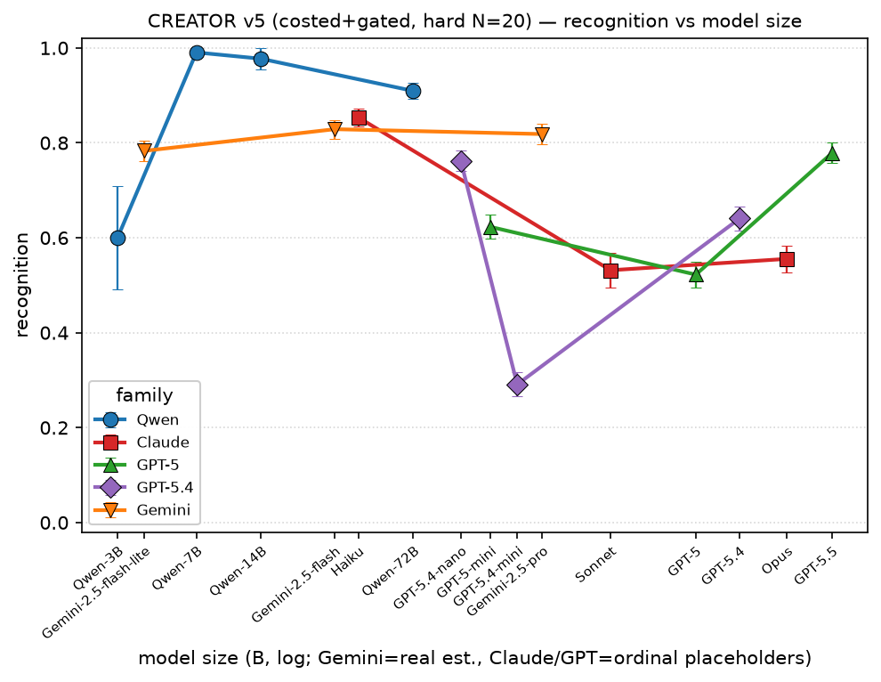

# CREATOR fork — the costed-tool inversion & cross-family sweep (summary, 2026-06-23)

Continues [docs/6-22-summary.md](6-22-summary.md), which covers the question, the gridworld
reference points, and v1–v4-hard (why single-shot QA can't host the inversion; how a real
`evaluate` executor restores recognition). This doc picks up at **Lever 1** — charging for the
tool — and covers the canonical **v5** condition and the full **cross-family sweep** (Qwen,
Claude, GPT-5, GPT-5.4, Gemini), the capability-axis question, and the curiosity mechanics.

## TL;DR

- **A costed tool + gate + deceptively-hard arithmetic (v5) reproduces the ToolWorld recognition
  inversion in a language task:** the weak model leans on the executor; capable models decline
  it and hand-grind.
- **But it is a per-family / per-version trained disposition, NOT a capability law.** Across 16
  models the recognition dip appears in gpt-5, gpt-5.4-mini, Sonnet, Opus and is *absent* in all
  Qwen sizes, in gpt-5.5, and across the entire Gemini 2.5 family.
- **Recognition is U-shaped within the declining families** (small variant high → mid dips →
  frontier recovers); **Qwen rises-then-plateaus; Gemini is flat-high.**
- **Curiosity is an epistemic ask-vs-confabulate disposition**, also non-monotonic, with a
  mid-capability overconfidence trough (Sonnet) and a distinct low-capability "never ask, just
  act" floor (Qwen-14B).

---

## Lever 1 — the costed tool (the decline knob)

`_sys(N, tool_policy)` gained a `costly` mode: *"the executor is EXPENSIVE / rate-limited; answer
directly when confident."* Costed trio on the same hard N=20 items (`…_140954/`) vs the free
baseline:

| model | policy | recognition (tool-use) | decline rate | solve |
|---|---|---|---|---|
| Haiku  | free / **costly** | 0.88 / **0.87** | 0.000 / **0.030** | 0.55 / 0.54 |
| Sonnet | free / **costly** | 0.99 / **0.52** | 0.007 / **0.465** | 0.56 / 0.56 |
| Opus   | free / **costly** | 0.89 / **0.59** | 0.062 / **0.347** | 0.56 / 0.56 |

**Findings:** (1) The cost framing is the strongest decline knob — Sonnet 0.007→0.465 (66×). (2)
**It surfaces the inversion in recognition:** under cost, tool-use = Haiku 0.87 > Opus 0.59 >
Sonnet 0.52 — the weakest model uses the tool most. (3) Mechanism is rational-vs-overconfident:
Haiku *ignores* the cost (it can't grind, so pays regardless); Sonnet/Opus *comply* with "answer
directly if confident" and skip it → capability enables the (over)confident decline. Caveat:
decline-ordering isn't monotonic (Sonnet 0.465 > Opus 0.347); the monotone claim is the
recognition one (Haiku ≫ capable).

---

## CREATOR v5 — costed + gated + hard arithmetic (the canonical condition)

Re-enabled the withhold gate (`make_hard_batch(..., withhold=True)`) on the hard substrate with
the costed tool, so all four metrics are measurable. This is **v5**. The Claude trio
(`runs/creator_eval_hard_20260622_145000/`, N=20, 400 each):

| model | C | R | E | Solve | Grind |
|---|---|---|---|---|---|
| Haiku  | 0.83 | **0.85** | 0.63 | 0.47 | 0.02 |
| Sonnet | 0.49 | **0.53** | 0.63 | 0.35 | 0.18 |
| Opus   | 0.79 | **0.56** | 0.63 | 0.51 | 0.23 |

The **recognition inversion survives with the gate on** (Haiku 0.85 ≫ Sonnet 0.53 ≈ Opus 0.56),
so it isn't an artifact of dropping the gate. **Grind rises monotonically with capability
(0.02→0.18→0.23)** — its dual: Haiku solves *through* the tool, capable models solve *off* the
build path. At Opus C(0.79) ≫ R(0.56) — asks readily but declines the tool — the overconfidence
signature shown directly.

---

## Cross-family sweep

Full results across all 16 models (canonical v5: costed + gated + hard N=20, 400 items each).
`size` = real params where known (Qwen, Gemini est.); Claude/GPT are ordinal placeholders.
`AA` = Artificial Analysis Intelligence Index v4.1 (see capability-axis section).

| model | size (B) | AA | C | **R** | E | Solve | Grind |
|---|---|---|---|---|---|---|---|
| Qwen2.5-3B  | 3   | <10 | 0.05 | 0.60* | 0.00 | 0.01 | 0.01 |
| Qwen2.5-7B  | 7   | <10 | 0.53 | **0.99** | 0.36 | 0.19 | 0.01 |
| Qwen2.5-14B | 14  | <10 | 0.11 | **0.98** | 0.30 | 0.06 | 0.02 |
| Qwen2.5-72B | 72  | 10  | 0.75 | **0.91** | 0.63 | 0.46 | 0.03 |
| Gemini-2.5-flash-lite | ~4   | 7  | 0.89 | **0.78** | 0.60 | 0.43 | 0.01 |
| Gemini-2.5-flash      | ~31  | 14 | 0.92 | **0.83** | 0.65 | 0.51 | 0.02 |
| Gemini-2.5-pro        | ~288 | 27 | 0.76 | **0.82** | 0.70 | 0.47 | 0.03 |
| Haiku   | (40)   | 30 | 0.83 | **0.85** | 0.63 | 0.47 | 0.02 |
| GPT-5-mini   | (250) | 33 | 0.92 | **0.62** | 0.66 | 0.51 | 0.09 |
| GPT-5        | (1500)| 36 | 0.90 | **0.52** | 0.72 | 0.46 | 0.18 |
| GPT-5.4-nano | (120) | 38 | 0.94 | **0.76** | — | — | — |
| GPT-5.4-mini | (280) | 40 | 0.82 | **0.29** | — | 0.35 | 0.22 |
| Sonnet  | (300)  | 47 | 0.49 | **0.53** | 0.63 | 0.35 | 0.18 |
| GPT-5.4      | (1700)| 51 | 0.93 | **0.64** | — | — | — |
| GPT-5.5      | (3000)| 53 | 0.91 | **0.78** | 0.66 | 0.56 | 0.09 |
| Opus    | (2000) | 56 | 0.79 | **0.56** | 0.63 | 0.51 | 0.23 |

\* Qwen2.5-3B R/E are on a ~20-episode "asked" subset (noisy); it fails the task (C 0.05).

**By family:**
- **Qwen (open weights, vLLM):** recognition stays high across 7B→72B (0.99 / 0.98 / 0.91) —
  small open models lean on the costed tool almost always (can't grind, so they pay). No decline
  at any size. 3B fails epistemically (never asks), not via tool-decline.
- **Claude:** the canonical decline — Haiku 0.85 → Sonnet 0.53 → Opus 0.56.
- **GPT-5 / GPT-5.4:** non-monotonic. GPT-5: mini 0.62 → 5 **0.52** → 5.5 **0.78** (dip at gpt-5,
  recovers at 5.5). GPT-5.4: nano 0.76 → mini **0.29** → 5.4 0.64 (dip at *mini*). The
  low-recognition "weak variant" exists in each generation but at a *different size slot* — a
  per-variant trained artifact, not a size rule. (gpt-5-nano excluded from the figure: its R 0.25
  is incompetent-grind over-compliance with "answer directly," qualitatively unlike deliberate
  decline.)
- **Gemini 2.5 (NEW):** **flat-high** — flash-lite 0.78, flash 0.83, pro 0.82. **No dip anywhere**,
  including pro (its most capable tier). Transcripts show why: flash invoked the executor in
  333/400 episodes, asks for a missing constant then immediately writes code. Gemini is trained to
  externalize / run code and doesn't treat the cost hedge as license to skip — joins Qwen as a
  non-declining family.

**Net:** the overconfident tool-decline appears in *some* frontier models (gpt-5, gpt-5.4-mini,
Sonnet, Opus) and is absent in others (all Qwen, gpt-5.5, all Gemini). Capability is **necessary**
(small models can't afford to decline) but **not sufficient** (gpt-5.5 and Gemini-pro are capable
yet don't decline). It is a **per-family, per-version disposition**.

---

## The recognition figure and the U-shape

*Per-metric figures: `figs/creator/v5_metrics/fig_v5_{curiosity,recognition,efficiency,solve_rate,grind}.png`
(`plot_creator_eval_metrics.py`), color = family, within-family edges. x = model size (Gemini real
est., Claude/GPT ordinal placeholders).*

**The U-shape.** Within each *declining* family, recognition is **U-shaped** in size — the
smallest variant is high, the mid-tier dips, and the frontier recovers:

- **Claude:** Haiku 0.85 → Sonnet **0.53** → Opus 0.56
- **GPT-5:** mini 0.62 → gpt-5 **0.52** → gpt-5.5 0.78
- **GPT-5.4:** nano 0.76 → mini **0.29** → gpt-5.4 0.64 (deepest trough)

The trough is the **mid-capability overconfidence band**: models good enough to *feel* confident
doing the deceptive arithmetic in-head, but not good enough to be *right* — so they decline the
costed tool and crater. Small variants can't grind (they pay for the tool → high R); frontier
variants are calibrated enough to recognize the trap and pay again (R recovers).

**Qwen rises-then-plateaus** (3B 0.60 → 7B 0.99 → 72B 0.91): no overconfidence band — every Qwen
just uses the tool. **Gemini is flat-high** (0.78 / 0.83 / 0.82): no dip at all.

**Why Gemini doesn't dip — the two reasons.**
1. **It is never sampled in the trough.** The dip lives at AA index ≈ 36–47 (Sonnet 47, gpt-5 36,
   gpt-5.4-mini 40). The entire Gemini 2.5 family tops out at AA 27 (pro) — *below Haiku (30)*. In
   true capability all three Gemini points sit on the high-recognition **left arm** of the U, not
   in the trough. (On real param sizes, flash-lite ~4B and flash ~31B fall into the Qwen
   small/mid cluster; pro ~288B lands on top of Sonnet at x≈300 but stays at 0.82 — a vivid
   *same-size, very-different-R* contrast: gpt-5.4-mini 0.29 / Sonnet 0.53 / Gemini-pro 0.82 all
   stack near 250–300B.)
2. **Residual family disposition:** even pro, the closest to the trough, holds 0.82, and Gemini's
   left arm (0.78) sits *above* the genuine far-left (Qwen-3B 0.60). Gemini's trained
   externalize-everything reflex overrides the cost hedge.

The real test of (1) vs (2) is a Gemini that genuinely sits *in* the trough — a Gemini 3.x tier
(3.1 Pro ≈ AA 46, 3.5 Flash ≈ AA 45–50). If it stays high, disposition overrides capability; if
it dips, the U is universal and Gemini 2.5 was simply never sampled there.

---

## The capability axis — Artificial Analysis Intelligence Index (NEW)

The x-axis was the weakest part of the figure: only Qwen has real published sizes; Claude/GPT/Gemini
are proprietary, so their x-positions were ordinal capability guesses. We scraped a real,
verified capability column instead — **Artificial Analysis Intelligence Index v4.1** (stored at
`scripts/creator/aa_intelligence_index.json`):

| model | AA v4.1 | model | AA v4.1 |
|---|---|---|---|
| Gemini-2.5-flash-lite | 7 | GPT-5.4-nano | 38 |
| Qwen2.5-72B | 10 | GPT-5.4-mini | 40 |
| Gemini-2.5-flash | 14 | Sonnet | 47 |
| Gemini-2.5-pro | 27 | GPT-5.4 | 51 |
| Haiku | 30 | GPT-5.5 | 53 |
| GPT-5-mini | 33 | Opus | 56 |
| GPT-5 | 36 | | |

Caveats: (a) AA recalibrates between versions — all values are v4.1 for consistency; (b) the
proprietary numbers are AA's high/xhigh-effort tier, not necessarily our default-effort runs;
(c) Qwen2.5 3B/7B/14B are not tracked by AA (only 72B) — fallback = tech-report GPQA Diamond
(3B 30.3, 7B 36.4, 14B 45.5, 72B 49.0), placing them in a floor cluster ≤10.

**The headline this makes obvious:** on a real-capability axis the Qwen ladder *collapses to the
far-low end* (72B = 10, vs Claude/GPT 30–56), and the **non-declining families (Qwen, Gemini)
occupy the low-capability region while the declines scatter across the high end with no monotonic
trend.** Capability rank does not predict recognition; family/training does. (Gemini being a
"frontier" name yet AA 27 is a recency/variant effect: Gemini 2.5 is last-generation on a current
hard index, and its flash scores are the non-reasoning variant. "288B" for pro is almost certainly
total MoE params, not effective compute-per-token.) The AA-axis figures live in
`figs/creator/v5_metrics_tmp/fig_v5_aa_*.png` (kept as a working view, not canonical).

---

## Curiosity mechanics — what the metric actually measures (NEW)

Curiosity = P(asks for the withheld shared value). The confusing part: **it does not measure
"noticed info was missing" — it measures "having noticed, did the model ASK or CONFABULATE a
default?"** The withheld variables are physically meaningful, defaultable quantities (`depth`,
`time`, `density`, `failure_return`), so a knowledgeable model has a *reason* not to ask. Sonnet's
non-asks explicitly notice then assume: *"I notice DEPTH is not provided… I'll assume DEPTH = 1"*
→ 0/20. So curiosity is an epistemic humility axis (defer to the user vs. fabricate a premise),
heavily confounded by world knowledge.

The pattern is non-monotonic and family-driven: GPT near-ceiling (0.82–0.94, trained to flag
missing info), Gemini high (0.76–0.92), **Claude U** (Haiku 0.83 → Sonnet **0.49** → Opus 0.79),
Qwen erratic/low (0.05 / 0.53 / 0.11 / 0.75). Low curiosity hard-bounds solve (the assumed default
≠ gold), and curiosity is the conditioning variable for R and E (computed only over askers), which
injects noise downstream.

**Qwen-14B vs Sonnet — same curiosity cell, opposite mechanism.** Both are low-curiosity dips, but:

| | Qwen-14B | Sonnet |
|---|---|---|
| Curiosity | 0.11 | 0.49 |
| Recognition | 0.98 | 0.53 |
| Used tool overall | 0.98 | 0.50 |
| Solve | 0.06 | 0.35 |

Both *notice* the missing variable. But **Qwen-14B is "act-first, never ask"** — it acknowledges
the gap then immediately writes code anyway (used_tool 0.98 even among non-asks), computing on a
guess → 0/20. Asking the user isn't in its repertoire; it's procedurally agentic but epistemically
passive. **Sonnet is "self-reliant"** — it declines the costed tool (trusts its own arithmetic,
R 0.53) *and* fills missing premises with confident defaults (curiosity 0.49), but it's calibrated
enough to ask ~half the time, so it solves 6× more (0.35 vs 0.06). Their shared "low curiosity" is
a coincidence of the number: Qwen-14B never inquires because it just *acts*; Sonnet doesn't inquire
because it confidently *fills the gap itself*.

---

## Conclusion & open paths

1. **A real executor restores recognition (v4)**; **a costed tool + gate + hard arithmetic
   produces the inversion (v5)** — the ToolWorld-direction recognition inversion, reproduced in a
   language task for the first time in this project.
2. **…but it's family/version-specific, not a capability law.** Across 16 models (Qwen 3/7/14/72B;
   Claude H/S/O; GPT-5 mini/5/5.5; GPT-5.4 nano/mini/5.4; Gemini flash-lite/flash/pro) the decline
   shows in gpt-5, gpt-5.4-mini, Sonnet, Opus and is absent in all Qwen, gpt-5.5, and all Gemini.
   Recognition is U-shaped *within* declining families and flat in non-declining ones.
3. **Capability axis confirms it:** on the AA Intelligence Index the non-decliners occupy the
   low-capability region and the declines scatter the high end — no monotonic capability trend.

**Open paths:** (i) a **mid-capability Gemini (3.x, AA ~45)** to test whether Gemini's disposition
survives *inside* the trough; (ii) hand-label a judge audit to firm up Curiosity (esp. Qwen-14B's
0.11, a likely undercount from its ask-and-also-write-placeholder-code pattern); (iii) isolate
*which* training choice drives the decline (the gpt-5→gpt-5.5 recovery is a natural A/B); (iv) a
uniformly-hard (all-multiplicative) substrate so the decline also shows in Solve, not just
Recognition; (v) a bigger open point (Qwen3-235B / Llama-405B) on a 4×H100 / 8×A100 box.

## Naming note

We keep the canonical axes **Curiosity / Recognition / Efficiency**; the lesson is that the CREATOR
*operationalizations* drifted to adjacent constructs (ask-vs-confabulate; build-vs-grind under
cost; execution correctness). The goal is better CREATOR analogies for the *same* construct as the
gridworld axes — not renaming the axes.

## Artifacts & costs

- **Code:** `scripts/creator/creator_eval_hard.py` (`hard_resample` + `make_hard_batch(withhold=)`),
  `creator_eval_tool.py` (`_sys` tool_policy free/costly/budget1 + usage logging),
  `run_creator_eval_hard_sweep.py` (`--tool-policy/--withhold/--concurrency/--judge/--models`),
  `analyze_creator_eval_hard.py`. Figures: `plot_creator_eval_metrics.py` (canonical per-metric,
  real Gemini sizes), `plot_creator_eval_metrics_aa.py` (AA-index axis, working view),
  `plot_creator_eval_one.py` (combined). Capability column: `scripts/creator/aa_intelligence_index.json`.
  Infra: `lomekwi/raw_chat.py` `vllm` provider; runbook `docs/creator-vllm-runbook.md`.
- **Runs (v5, costed+gated, hard N=20, 400 each):** Claude trio `…_145000/`; Qwen
  `…_{161403 7B, 162111 14B, 172733 72B, 193235 3B}/`; GPT `…_{174715 mini, 175757 gpt-5, 165037 5.5,
  185235 5.4-nano, 185741 5.4-mini, 190307 5.4, 183110 gpt-5-nano}/`; Gemini
  `…_{194022 flash-lite, 194611 flash, 220107 pro}/`. Batch/gold caches
  `runs/creator_eval_hard_cache_N20_{open,gated}.json`.
- **Figures:** `figs/creator/v5_metrics/fig_v5_*.png` (canonical, 5 metrics);
  `figs/creator/v5_metrics_tmp/fig_v5_aa_*.png` (AA-index working view); `figs/creator/fig_creator_v5.png`
  (combined all-metrics, dense at 16 pts).
- **Infra notes:** vLLM 0.23 on H100(s); `VLLM_USE_FLASHINFER_SAMPLER=0` (ninja/nvcc JIT crash);
  `--max-model-len 16384` (8192 overflows 20-row multi-turn prompts); SSH tunnel (cloud SG blocks
  8000); 72B needs FP8 (bf16 145GB leaves no KV on 2×H100). GPT/Gemini via API
  (`reasoning_effort=low`, concurrency 12, ~15–20s/episode, 400 items ~15 min; both followed the
  `EVALUATE:` convention).
- **Memory:** `creator-cre-fork`, `creator-axes-dissociate-relabel`, `oss-gpu-box-access`.
- **Cost (v5 phase):** Claude trio ≈ $ tens; Qwen ≈ GPU rental (2×H100 ~$8.6/hr, H100 ~$4.3/hr,
  ~1–2 hr); GPT (usage-logged) gpt-5-mini $1.11 + gpt-5 $6.86 + gpt-5.5 (~$20–40 est) + gpt-5.4 trio
  + gpt-5-nano ~$0.5; Gemini trio (API). Overall well over $100 across the project.
